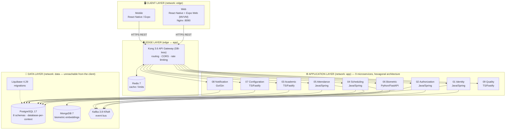
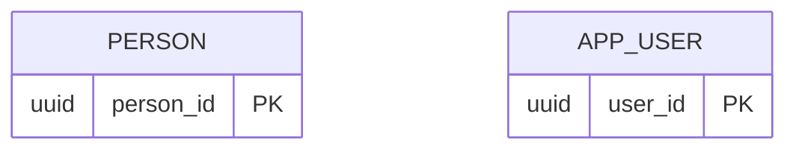
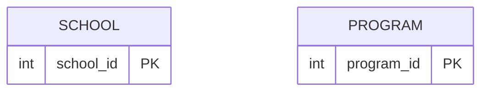
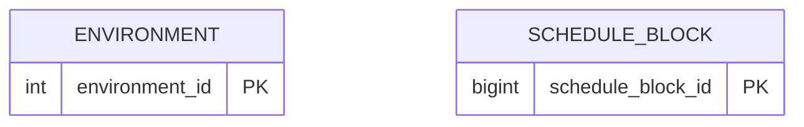
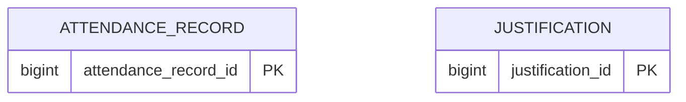
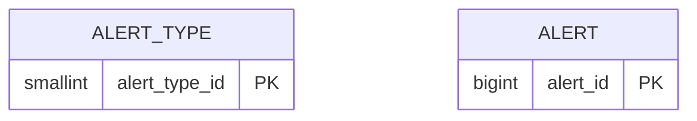
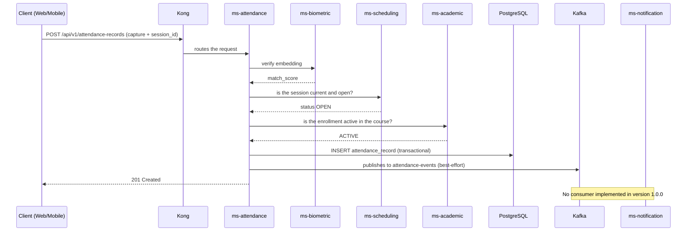

# 🎓 FaceAttend EDU

## System Technical Documentation

| | |
|---|---|
| **Project** | FaceAttend EDU — Educational attendance management platform with biometric validation |
| **Version** | 1.0.0 |
| **Reference branch** | `develop` |
| **Date** | October 2026 |
| **Standards applied** | ISO/IEC 25010 · IEEE 829 · ISTQB · ISO/IEC 29110 |

> **About this version.** This is the **completed and translated** version of the technical manual. Sections 1 to 10 are a translation of the original document. Sections **11 to 16** (programming interface, testing and quality assurance, deployment and environments, development conventions and version control, glossary and references) were written to finish the manual, based on the information declared in the earlier sections and in the repository documents cited there. All technical claims were checked against the repository on October 7, 2026. That check corrected the Kafka section: the real topics are per-entity `*-events` channels, and no service consumes them yet, so Sections 4 and 6.3 of the original text were adjusted to match the code.

---

## 1. Introduction

**FaceAttend EDU** is an educational attendance management platform that replaces manual attendance taking with an automated process based on **facial and fingerprint biometric identification**. The system validates the identity of students and teachers, manages the complete academic cycle (programs, courses, schedules, sessions and enrollments) and issues auditable, traceable attendance records.

The solution is conceived as a formal software engineering project: every design decision is documented by means of **Architecture Decision Records (ADRs)**, the services are organized by **bounded contexts** under DDD, and quality is verified against recognized standards (ISO/IEC 25010 for quality attributes, IEEE 829 and ISTQB for test documentation).

## 2. Objective

To develop and implement a technology platform that makes it possible to:

1. **Record and verify educational attendance biometrically** (face and fingerprint), eliminating identity impersonation ("proxy attendance") and manual recording errors.
2. **Manage the complete academic cycle**: programs, courses, schedules, scheduled sessions and student enrollment.
3. **Guarantee security and traceability**: JWT RS256 authentication, RBAC authorization, auditing on all entities and layered network isolation.
4. **Demonstrate software quality under formal standards**, with objective metrics reported by a dedicated microservice (ms-quality) and test documentation compliant with IEEE 829 / ISTQB.
5. **Operate reproducibly** by means of infrastructure as code (Docker Compose) and database as code (Liquibase + versioned SQL scripts).

## 3. Technical scope

**In scope:**

- **Polyglot modular monolith** architecture with DDD (8 domain bounded contexts + API Gateway) and **hexagonal architecture** (ports and adapters) inside each service.
- **9 microservices** specialized in Java 21, TypeScript, Python 3.12 and Go 1.22, orchestrated with Docker Compose.
- **Kong 3.6 API Gateway** (DB-less mode) as the only public entry point, with rate limiting via Redis.
- Persistence: **PostgreSQL 17** multi-schema (database-per-service strategy), **MongoDB 7** for biometric embeddings, **Redis 7** for caching/rate limiting and **Kafka 3.8 (KRaft)** as the asynchronous event bus.
- Versioned migrations with **Liquibase 4.29** and golang-migrate; documentary schema modeling in **DBML**.
- **Web** and **Mobile** clients built with React Native + Expo (the web app exported with `expo export --platform web` and served by Nginx), organized under the **MVVM** pattern.
- Network segmentation into **3 zones** (`edge`, `app`, `data`) as an infrastructure security control.
- Quality module with ISO/IEC 25010, ISTQB, IEEE 829 and ISO 29110 reports, and a catalog of error/quality codes.

**Out of scope (for now):**

- Integration with physical on-site fingerprint capture hardware (work is done against embedding APIs).
- Managed cloud deployment (Kubernetes/Terraform); the current target environment is local/containers.
- Billing, payments or administrative modules unrelated to attendance and the academic cycle.

## 4. Technical description of the system (solution summary)

FaceAttend EDU implements a **layered client-server** pattern with synchronous (REST) and asynchronous (event-based) communication:

- The **clients** (Web and Mobile, both React Native/Expo with MVVM logic) never access the services or the databases directly: every request passes through **Kong**, which resolves routes, applies CORS and rate limiting, and delegates the verification of **JWT RS256** tokens issued by `ms-identity` and the RBAC rules of `ms-authorization`.
- At the application layer, each microservice encapsulates a bounded context: `identity` (users and authentication), `authorization` (roles/permissions), `academic` (programs, courses, enrollments), `scheduling` (schedules and sessions), `attendance` (attendance recording), `biometric` (facial/fingerprint templates and vector matching in MongoDB), `configuration` (system parameters) and `notification` (alerts and email delivery). `quality` exposes system verification metrics.
- The **data layer** remains isolated in its own Docker network: PostgreSQL per context (no foreign keys between contexts — only logical UUIDs), MongoDB for embeddings, Kafka for domain events and Redis as gateway support.
- The critical attendance flow combines both worlds: biometric verification → validation of the current session and of the enrollment → transactional write of the record → publication of the event on the `attendance-events` topic, best-effort and outside the transaction.
- Startup is deterministic and verifiable: PostgreSQL → Liquibase migrations → microservices → ms-quality → Kong + Redis → frontend, chained together with Docker Compose *healthchecks*.

## 5. Technologies used

### 5.1 Languages and frameworks (by component)

| Component | Language | Exact version | Main framework / library | Version |
|---|---|---|---|---|
| 01-ms-identity | Java | 21 (Eclipse Temurin) | Spring Boot | 4.1.1 |
| 02-ms-authorization | Java | 21 (Eclipse Temurin) | Spring Boot | 4.1.1 |
| 04-ms-scheduling | Java | 21 (Eclipse Temurin) | Spring Boot | 4.1.1 |
| 05-ms-attendance | Java | 21 (Eclipse Temurin) | Spring Boot | 4.1.1 |
| 03-ms-academic | TypeScript | ^5.4.0 (Node 20 runtime) | Fastify + Drizzle ORM | ^4.26.0 / ^0.31.0 |
| 07-ms-configuration | TypeScript | ^5.4.0 (Node 20 runtime) | Fastify + pg | ^4.26.0 / ^8.11.0 |
| 09-ms-quality | TypeScript | ^5.4.0 (Node 20 runtime) | Fastify | ^4.26.0 |
| 06-ms-biometric | Python | ^3.12 | FastAPI + Uvicorn + OpenCV | ^0.110.0 / ^0.28.0 / ^4.9.0 |
| 08-ms-notification | Go | 1.22 | Gin + pgx + Zap | v1.9.1 / v5.5.0 / v1.26.0 |
| Web frontend | JavaScript/TypeScript | TS ~6.0.3 · React 19.2.3 | React Native + Expo (`react-native-web`) | RN 0.86.3 / Expo ^57.0.20 |
| Mobile frontend | JavaScript/TypeScript | TS ~5.9.2 · React 19.2.3 | React Native + Expo | RN 0.86.3 / Expo ~57.0.0 |

### 5.2 Databases and messaging

| Technology | Role | Exact version |
|---|---|---|
| PostgreSQL | Multi-schema relational DB (database-per-context) | 17-alpine |
| MongoDB | Store for biometric embeddings (vector search) | 7 |
| Redis | Gateway caching and rate limiting | 7-alpine |
| Apache Kafka (KRaft, without Zookeeper) | Asynchronous event bus between contexts | 3.8.0 |
| Liquibase | Schema migrations (database-as-code) | 4.29.0 |
| golang-migrate | Migrations for the notification service | v4.17.0 |
| DBML | Documentary modeling of the schema (`faceattend_edu_mr_v4.dbml`) | — |

### 5.3 Infrastructure, gateway and deployment

| Technology | Role | Exact version |
|---|---|---|
| Kong (OSS, DB-less) | API Gateway: routing, CORS, rate limiting | 3.6 |
| Docker Compose | Local orchestration with 3 segmented networks | own declarative stack |
| Nginx | Static server for the web bundle (`expo export`) | 1.27-alpine |
| Node.js | Frontend build runtime | 20-alpine |
| Maven (mvnw wrapper) | Build of the Java services | 3.9 (`maven:3.9-eclipse-temurin-21-alpine` image) |
| Poetry | Python dependency management (biometric) | python ^3.12 |
| OpenTelemetry (Go) | Observability in ms-notification | v1.24.0 |

### 5.4 Security

| Technology | Role | Version |
|---|---|---|
| Spring Security | Authentication/authorization in the Java services | included in Spring Boot 4.1.1 |
| JWT RS256 | Session tokens signed with a key pair | `jjwt` library (Java) |
| go-playground/validator | Input validation in Go | v10.16.0 |

### 5.5 Version control

| Tool | Version | Use in the project |
|---|---|---|
| Git | 2.39.5 | Monorepo with branches per integration cycle (`develop` as the working branch); conventional commits (`chore(compose): …`, `feat(ms-x): …`) |
| GitHub | SaaS platform | Remote hosting, backup and review of the repository |

## 6. System architecture

### 6.1 Layer diagram (client-server)



### 6.2 Internal structure of each service (hexagonal)

```
┌───────────────────────────────────────────────┐
│  domain/          Entities, value objects,    │  ← pure business rules,
│                   ports (interfaces)          │    no external dependencies
│  ┌─────────────────────────────────────────┐  │
│  │ application/  Use cases that orchestrate│  │  ← use cases
│  │               the domain                │  │
│  │  ┌───────────────────────────────────┐  │  │
│  │  │ infrastructure/adapters/          │  │  │  ← HTTP controllers,
│  │  │  http · persistence · messaging   │  │  │    JPA/Drizzle/pgx/Mongo,
│  │  └───────────────────────────────────┘  │  │    Kafka producers/consumers
│  └─────────────────────────────────────────┘  │
└───────────────────────────────────────────────┘
```

### 6.3 Explanation of the flow

**Synchronous flow (REST through Kong):**

1. **Authentication:** the client sends credentials to `POST /api/v1/auth/login` → Kong routes to **ms-identity** → validates the credentials (BCrypt) against PostgreSQL → issues a **JWT RS256** with role claims → **ms-authorization** defines the associated RBAC permissions.
2. **Biometric enrollment:** face/fingerprint capture → **ms-biometric** generates the embedding (vector) and stores it in **MongoDB**; the template is linked to the student via UUID.
3. **Attendance recording:** the teacher opens a session (**ms-scheduling**) → the student is verified → **ms-attendance** coordinates: biometric *matching* (ms-biometric), temporal validity of the session (ms-scheduling) and active enrollment (ms-academic) → writes the record transactionally to PostgreSQL.

**Asynchronous flow (Kafka events):**

- Every relevant action publishes a domain event on its entity topic (`attendance-events`, `identity-events`, `role-events`, and so on; see Section 11.8).
- Publication does not block the transactional flow: if the broker does not respond, the failure is logged as a warning and the operation continues.
- **There are no consumers yet.** `ms-notification` (Go) declares no Kafka dependency: it builds its alerts from the HTTP requests it receives and sends them over SMTP. The bus is in place so that consumers can be added without touching the producers.

**Cross-cutting rules:**

- Only **logical UUIDs** travel between bounded contexts (no real FKs between schemas) → low coupling.
- Standard auditing on all tables: soft-delete, timestamps and optimistic locking.
- Security by network: the client can only reach Kong; Kong can only reach the `app` layer; only the `app` layer can reach the `data` network.

**Orchestrated startup order (healthchecks):** PostgreSQL → Liquibase migrations per context → microservices → ms-quality → Kong + Redis → Web frontend.

## 7. Project structure

### 7.1 Folder tree

```
/workspace
├── docker-compose.yml                  # General orchestration: edge/app/data networks, healthchecks
├── COMPOSE.md                          # Documentation of the Docker Compose environment
│
├── front-end/
│   ├── Web/                            # React Native + Expo app exported to web (react-native-web)
│   │   ├── Dockerfile                  # Build node:20 → expo export → nginx:1.27
│   │   ├── nginx.conf                  # Static serving + SPA fallback
│   │   └── src/
│   │       ├── api/                    # Base HTTP client towards Kong
│   │       ├── config/                 # Environment configuration (URLs, variables)
│   │       ├── context/                # Global contexts (Auth, Theme, Responsive)
│   │       ├── core/                   # Cross-cutting: constants, hooks, storage, theme, utils
│   │       ├── models/                 # Types and data structures per domain
│   │       ├── navegation/             # React Navigation: public/authenticated stacks + deep linking
│   │       ├── services/api/           # One module per microservice (authApi, academicApi, ...)
│   │       ├── view/                   # VIEW (V): components/ and screens/ (authorized/)
│   │       └── viewmodels/             # VIEWMODEL (VM): hooks with presentation logic
│   └── Mobile/                         # React Native + Expo mobile app
│       ├── src/
│       │   ├── api/ · services/        # HTTP access to Kong
│       │   ├── assets/images/          # Static resources
│       │   ├── hooks/ · utils/         # Hooks and utilities (locales/i18n)
│       │   ├── models/                 # Types per context: identity, academic, attendance,
│       │   │                           #   scheduling, authorization, notification, ...
│       │   ├── navigations/            # React Navigation
│       │   └── storage/                # Local persistence (JWT tokens)
│       ├── scripts/                    # Development utilities
│       └── seed/                       # Seed data for mobile testing
│
├── back-end/                           # Microservices + gateway (DDD + hexagonal)
│   ├── 01-ms-identity/                 # Java 21 / Spring Boot — users and JWT authentication
│   │   └── src/main/java/com/faceattend_edu/identity_service/
│   │       ├── domain/                 # Entities and ports
│   │       ├── application/            # Use cases
│   │       ├── adapter/                # REST controllers, JPA, Kafka
│   │       ├── config/ · shared/       # Cross-cutting (security, exceptions, audit)
│   ├── 02-ms-authorization/            # Java — RBAC roles and permissions
│   ├── 03-ms-academic/                 # TS/Fastify — programs, courses, enrollments
│   │   └── src/{domain/{entities,ports}, application/use-cases,
│   │            infrastructure/{http,persistence,db,messaging}}
│   ├── 04-ms-scheduling/               # Java — schedules and sessions
│   ├── 05-ms-attendance/               # Java — attendance recording
│   ├── 06-ms-biometric/                # Python/FastAPI — face/fingerprint, embeddings → MongoDB
│   │   └── {domain/{entities,value_objects,ports}, infrastructure/{web,persistence},
│   │        tests/{unit,support}}
│   ├── 07-ms-configuration/            # TS/Fastify — system parameters
│   ├── 08-ms-notification/             # Go/Gin — alerts + SMTP email
│   │   └── {cmd/, internal/{domain/port, application/usecase,
│   │            infrastructure/{http,postgres,config}}, migrations/}
│   ├── 09-ms-quality/                  # TS/Fastify — ISO/IEC 25010 metrics and reports
│   ├── 99-api-gateway/kong/kong.yml    # DB-less definition: routes, upstreams, plugins
│   ├── quality/quality-codes.md        # Catalog of quality/error codes
│   ├── docker-compose.yml              # Backend stack (Kong, Kafka, Mongo, Redis, MSs)
│   └── *.md                            # Formal documents: QUALITY.md, ISO25010,
│                                       #   IEEE829 (plan/cases/incidents/summary),
│                                       #   ISTQB, ISO29110, SERVICES.md, DATABASE.md
│
├── database/                           # Database-as-code, one directory per context
│   ├── 01-ms-identity-db/ … 08-ms-notification-db/
│   │   ├── 01-ddl/                     # Tables, indexes, triggers
│   │   ├── 02-dml/                     # Seeds (initial data)
│   │   ├── 03-dcl/                     # Roles, grants, security
│   │   ├── 04-tcl/                     # Transaction control
│   │   ├── 05-rollbacks/               # Reversible scripts
│   │   └── changelog/                  # Liquibase changelogs (changelog.xml)
│   ├── database-init/                  # PostgreSQL bootstrap (schemas and users)
│   ├── scripts/init-multidb.sql        # Multi-database initialization
│   ├── docker-compose.yml              # postgres:17-alpine + liquibase:4.29.0
│   ├── faceattend_edu_mr_v4.dbml       # Documentary relational model (DBML)
│   └── CONVENCIONES.md · ESTRUCTURA.md · MODELO.md · SEEDS.md
│
└── tools/
    └── seed-api-test-data/             # Test data loader consuming the real API
```

### 7.2 Explanatory table of the main folders

| Folder | What it does |
|---|---|
| `docker-compose.yml` (root) | Single entry point of the stack: defines the 3 isolated networks (`edge`, `app`, `data`), volumes and the startup chain with healthchecks. |
| `front-end/Web/src/view` | **View (V)** layer of MVVM: reusable components and screens (public and `authorized/`). |
| `front-end/Web/src/viewmodels` | **ViewModel (VM)** layer: hooks that contain the presentation logic, consume `services/api` and feed the view. It is the functional equivalent of client-side "controllers". |
| `front-end/Web/src/services/api` | Data access layer: one module per microservice; centralizes REST calls towards Kong. |
| `front-end/Web/src/navegation` | Definition of public/authenticated navigators (React Navigation) and deep linking; it does not use a traditional web router. |
| `front-end/Web/src/context` and `core` | Global state (session, theme, responsive) and cross-cutting infrastructure (local storage, constants, utilities). |
| `front-end/Mobile/src/models` | Data types typed by the 8 bounded contexts, a contractual mirror of the backend DTOs. |
| `back-end/01..09-ms-*` | One directory per bounded context. Internally: `domain` (entities/ports) → `application` (use cases) → `infrastructure/adapter` (HTTP, persistence, messaging). This is where the business logic lives, equivalent to "backend/controllers" but segregated by hexagonal layers. |
| `back-end/99-api-gateway/kong` | `kong.yml`: DB-less declaration of upstream services, routes and plugins (rate limiting with Redis, CORS). The only point of public exposure. |
| `back-end/*.md` and `back-end/quality` | Formal quality documentation: ISO/IEC 25010, ISTQB and ISO 29110 reports, IEEE 829 test specification and catalog of quality codes. |
| `database/<NN>-ms-*-db/01-ddl…05-rollbacks` | SQL organized by sublanguage (DDL/DML/DCL/TCL) with explicit rollbacks per script: allows each context's schema to be reproduced and reverted. |
| `database/<NN>-ms-*-db/changelog` | Liquibase changelogs executed automatically when the stack starts (database-as-code). |
| `database/faceattend_edu_mr_v4.dbml` | Diagram/relational model of the system in DBML as the documentary source of the schema. |
| `tools/seed-api-test-data` | Utility that populates end-to-end test data by consuming the real API (it validates contracts, it does not insert SQL directly). |

---

## 8. Database

### 8.1 Engines used

The system uses **polyglot persistence**: each technology covers the type of data for which it is best suited.

| Engine | Version | Use | Container / Name |
|---|---|---|---|
| **PostgreSQL** | **17-alpine** | Transactional relational data. One schema per bounded context (*database-per-context* strategy on a single instance). | **`faceattend_db`** |
| **MongoDB** | **7** | Facial and fingerprint embeddings, in two document collections. | **`faceattend_biometric`** |
| **Redis** | **7-alpine** | Kong rate-limiting counters (stores no business data). | — |
| **Apache Kafka (KRaft)** | **3.8.0** | Domain event bus (transports events only; persists no business data). | — |

**Connection details (development environment):** internal host `postgres` (Docker network `data`), port **5432**. The port is **not published to the client**: only the microservices on the `app` network can reach it. Each service connects with its **own database user**, with privileges only on its own schema (see Section 9.5).

### 8.2 Database organization (database-per-context)

A single PostgreSQL server hosts **eight schemas**, one per bounded context. This design makes it possible to migrate each context to its own server in the future without redesigning the model.

| Schema | Owning microservice | Tables | Content |
|---|---|---|---|
| **`identity`** | 01-ms-identity | 4 | People, application users, sessions, and the password policy |
| **`authorization`** | 02-ms-authorization | 4 | Roles, permissions, and their assignment to roles and users |
| **`academic`** | 03-ms-academic | 8 | Schools, programs, periods, cohorts, courses, academic actors, and enrollments |
| **`scheduling`** | 04-ms-scheduling | 3 | Environments, schedule blocks, and class sessions |
| **`attendance`** | 05-ms-attendance | 5 | Attendance records, justifications, supporting documents, and reports |
| **`biometric`** | 06-ms-biometric | **0** | **No relational tables.** This context persists exclusively in MongoDB (Section 8.4) |
| **`configuration`** | 07-ms-configuration | 3 | Academic and security parameters, and biometric update cases |
| **`notification`** | 08-ms-notification | 2 | Alert catalog and raised alerts |

**Design rules of the model:**

- **No foreign keys between schemas.** Only logical identifiers travel between contexts; for example, `attendance.attendance_record.academic_actor_id` references `academic.academic_actor` with no physical FK. Integrity between contexts is guaranteed by the application layer. The relational model file marks each of these references explicitly as *cross-context (sin FK)*.
- **Primary keys are chosen per table, not uniform.** `uuid` is used where the identifier travels between contexts or is exposed publicly (`person`, `app_user`, `user_session`, `attendance_report`, `biometric_update_case`); `int`, `smallint`, or `bigint` identity columns are used for catalogs and for high-volume tables; and the two join tables of the `authorization` schema use a **composite primary key**.
- **Standard auditing on every table**, with seven columns: `created_at`, `updated_at`, `deleted_at` (`TIMESTAMP`), `created_by`, `updated_by`, `deleted_by` (`UUID`) and `row_version` (`BIGINT`, default 1) for *optimistic locking*. Deletion is always logical (*soft-delete*).
- **Uniqueness scoped to the owner.** Codes are unique within their school or program rather than globally: `uq_program_code_school`, `uq_course_code_program`, `uq_environment_code_school`, `uq_period_name_school`. The e-mail of a person is unique only among live rows (`where: deleted_at IS NULL`), so a soft-delete releases the address for reuse.
- **Database-as-code:** the schema is created with versioned Liquibase changelogs under `database/<NN>-ms-*-db/01-ddl`, organized into `00-extensions`, `01-schemas`, `02-types`, `03-tables`, `05-materialized-views`, `06-functions`, `07-procedures`, `08-triggers` and `09-indexes`, each with its rollback. The notification service additionally uses **golang-migrate v4.17.0**.

### 8.3 Entity-relationship diagrams

The complete model is `database/faceattend_edu_mr_v4.dbml`, which can be visualized at [dbdiagram.io](https://dbdiagram.io) and is the source of truth for names and types. It is presented below in five figures, one per group of contexts. **Solid** lines are physical foreign keys inside a schema; **dotted** lines are logical references between schemas, which carry no FK.











The `configuration` schema has no diagram of its own: its three tables hold parameters and cases that carry no foreign keys between them. They are documented in Section 8.5.

**Key relationships:**

| Relationship | Cardinality | Meaning |
|---|---|---|
| `person` → `app_user` | 1:1 | A person has at most one application account; `app_user.person_id` is unique. |
| `app_user` → `user_session` | 1:N | Each login opens a session row with its start, end, source IP, and status. |
| `role` → `role_permission` ← `permission` | N:M | Basis of RBAC access control, with a composite primary key. |
| `app_user` ⇢ `user_role` → `role` | N:M | A user holds several roles. The reference to the user is logical, since it crosses from `authorization` into `identity`. |
| `school` → `program` → `course` | 1:N | A school offers programs and each program contains courses. |
| `program` + `academic_period` → `cohort` | N:1 each | A cohort is a group of a program framed within a period. |
| `person` ⇢ `academic_actor` | 1:N (logical) | The same person may act as a student in one school and as an instructor in another; `academic_actor_type` distinguishes the role. |
| `academic_actor` → `enrollment` ← `cohort` | N:M | An actor enrolls in cohorts; the pair is unique. |
| `environment` → `schedule_block` → `class_session` | 1:N | A recurring block in an environment generates dated sessions; the pair block-date is unique. |
| `class_session` ⇢ `attendance_record` ⇠ `academic_actor` | 1:N (logical) | One record per actor and session, enforced by `uq_attendance_session_actor`. |
| `attendance_record` → `justification` | 1:1 | A record admits at most one justification; `attendance_record_id` is unique in `justification`. |
| `justification` → `supporting_document` | 1:N | Evidence files attached to the justification. |
| `alert_type` → `alert` | 1:N | The catalog defines severity and channel; each alert points to its type. |

> **Note.** The attendance flow therefore crosses three schemas without a single physical foreign key between them: the session lives in `scheduling`, the actor in `academic`, and the record in `attendance`.

### 8.4 MongoDB collections (biometric embeddings)

The `biometric` context has no relational tables. It persists in two separate document collections, one per biometric modality.

| Collection | Field | Type | Description |
|---|---|---|---|
| **`facial_embedding`** | `person_id` | string (UUID) | Owner of the template; the logical reference to `identity.person`. |
| | `template_version` | int | Version of the template, which allows re-enrollment without losing history. |
| | `encoding` | array\<double\> | Feature vector extracted from the face. |
| | `model_version` | string | Version of the model that produced the vector. |
| | `enrolled_at` | date | Enrollment date. |
| | `is_active` | boolean | Marks the template currently in force. |
| **`fingerprint_embedding`** | `person_id` | string (UUID) | Owner of the template. |
| | `finger_number` | int | Finger enrolled, 1 to 10. |
| | `template_version` | int | Version of the template. |
| | `encoding` | array\<double\> | Feature vector extracted from the fingerprint. |
| | `model_version` | string | Version of the model that produced the vector. |
| | `enrolled_at` | date | Enrollment date. |
| | `is_active` | boolean | Marks the template currently in force. |

The link from the relational side is `configuration.biometric_update_case.current_embedding_ref`, which stores the document identifier as free text. It is deliberately **not** a real foreign key, because the reference crosses paradigms from SQL to NoSQL.

Embeddings **are not images**: the original face or fingerprint cannot be reconstructed from the vector, which reduces the privacy risk in the event of a leak.

### 8.5 Data dictionary

Every table listed below additionally carries the seven **audit columns** described in Section 8.2 (`created_at`, `updated_at`, `deleted_at`, `created_by`, `updated_by`, `deleted_by`, `row_version`), which are not repeated in each entry.

**Schema `identity`**

| Table | Primary key | Business columns | Purpose |
|---|---|---|---|
| `person` | `person_id` uuid | `document_number`, `document_type`, `name`, `last_name`, `email`, `phone`, `blood_type`, `birth_date`, `address`, `status` | Natural person. Unique by document type and number; the e-mail is unique among live rows. |
| `app_user` | `user_id` uuid | `person_id` (unique), `username` (unique), `password_hash`, `authentication_type`, `status`, `last_access` | Login account. `authentication_type` accepts Local, Windows, or External. |
| `user_session` | `session_id` uuid | `user_id`, `start_date`, `end_date`, `source_ip`, `session_status` | Session opened by a user. `session_status` is Active or Closed. |
| `password_policy` | `policy_id` int | `min_length`, `max_length`, `requires_uppercase`, `requires_numbers`, `requires_symbols`, `expiration_days` | Password rules applied at registration and at change. |

**Schema `authorization`**

| Table | Primary key | Business columns | Purpose |
|---|---|---|---|
| `role` | `role_id` int | `role_name` (unique), `description` | Role of the RBAC model. |
| `permission` | `permission_id` int | `permission_name` (unique), `description` | Individual permission. |
| `role_permission` | (`role_id`, `permission_id`) | `assignment_date` | Permissions granted to a role. |
| `user_role` | (`user_id`, `role_id`) | `assignment_date` | Roles assigned to a user. `user_id` is a logical reference to `identity.app_user`. |

**Schema `academic`**

| Table | Primary key | Business columns | Purpose |
|---|---|---|---|
| `school` | `school_id` int | `code` (unique), `name`, `city_id`, `city_name`, `district`, `country`, `address`, `phone`, `email`, `status` | Training center. `city_id` points to an external catalog and carries no FK. |
| `program` | `program_id` int | `school_id`, `code`, `name`, `status` | Training program. The code is unique within its school. |
| `academic_period` | `academic_period_id` int | `school_id`, `name`, `starts_on`, `ends_on`, `is_active` | Period over which reports are consolidated. |
| `cohort` | `cohort_id` bigint | `program_id`, `academic_period_id`, `code` (unique), `status` | Training group of a program within a period. |
| `course` | `course_id` int | `program_id`, `code`, `name`, `credit_hours`, `status` | Course or competency. The code is unique within its program. |
| `academic_actor_type` | `actor_type_id` smallint | `code` (unique), `name` | Catalog of actor types: STUDENT and INSTRUCTOR. |
| `academic_actor` | `academic_actor_id` bigint | `person_id`, `actor_type_id`, `school_id`, `actor_code`, `started_on`, `ended_on`, `status` | A person acting in a school under a given type. Unique by school, type, and code. |
| `enrollment` | `enrollment_id` bigint | `academic_actor_id`, `cohort_id`, `enrolled_on`, `enrollment_status` | Enrollment of an actor in a cohort. Status: Active, Withdrawn, or Completed. |

**Schema `scheduling`**

| Table | Primary key | Business columns | Purpose |
|---|---|---|---|
| `environment` | `environment_id` int | `school_id`, `code`, `name`, `capacity`, `status` | Classroom or environment. The code is unique within its school. |
| `schedule_block` | `schedule_block_id` bigint | `cohort_id`, `course_id`, `environment_id`, `instructor_actor_id`, `day_of_week`, `starts_at`, `ends_at` | Recurring slot. Two unique indexes prevent an environment or an instructor from being double-booked in the same slot. |
| `class_session` | `class_session_id` bigint | `schedule_block_id`, `session_date`, `opened_by`, `opened_at`, `closed_by`, `closed_at`, `session_status` | Dated instance of a block. Status: Open, Closed, or Cancelled. Unique by block and date. |

**Schema `attendance`**

| Table | Primary key | Business columns | Purpose |
|---|---|---|---|
| `attendance_record` | `attendance_record_id` bigint | `class_session_id`, `academic_actor_id`, `attendance_status`, `captured_at`, `capture_method`, `match_score` | Attendance of one actor in one session. Status: Present, Absent, Late, or Justified. Method: FACIAL, MANUAL, IOT, or IMPORT. |
| `justification_type` | `justification_type_id` int | `school_id`, `name`, `description`, `requires_attachment`, `status` | Catalog of justification types. A null `school_id` marks a global type. |
| `justification` | `justification_id` bigint | `attendance_record_id` (unique), `justification_type_id`, `reason`, `submitted_at`, `reviewed_by`, `reviewed_at`, `review_status`, `resolution_notes` | Justification of an absence. Status: Pending, Approved, or Rejected. |
| `supporting_document` | `supporting_document_id` bigint | `justification_id`, `file_name`, `storage_uri`, `mime_type`, `size_bytes` | Evidence file attached to a justification. |
| `attendance_report` | `report_id` uuid | `school_id`, `cohort_id`, `generated_by`, `report_type`, `filters` (jsonb), `result` (jsonb), `generated_at` | Generated report, with its filters and its result stored as JSON. |

**Schema `configuration`**

| Table | Primary key | Business columns | Purpose |
|---|---|---|---|
| `academic_configuration` | `configuration_id` int | `school_id`, `configuration_name`, `configuration_value`, `description` | Academic parameter per school, for example `tardy_tolerance_minutes`. Unique by school and name. |
| `security_configuration` | `configuration_id` int | `configuration_name` (unique), `configuration_value`, `description` | Global security parameter. |
| `biometric_update_case` | `case_id` uuid | `person_id`, `biometric_type`, `finger_number`, `current_embedding_ref`, `reason`, `update_status`, `requested_by`, `requested_at`, `reviewed_by`, `reviewed_at`, `resolution_notes` | Request to re-enroll a biometric template. A CHECK constraint requires `finger_number` between 1 and 10 when the type is FINGERPRINT and null when it is FACIAL. |

**Schema `notification`**

| Table | Primary key | Business columns | Purpose |
|---|---|---|---|
| `alert_type` | `alert_type_id` smallint | `code` (unique), `name`, `severity`, `channel` | Catalog of alerts. Severity: INFO, WARNING, or CRITICAL. Channel: DASHBOARD, EMAIL, or PUSH. |
| `alert` | `alert_id` bigint | `academic_actor_id`, `alert_type_id`, `raised_at`, `resolved_at` | Alert raised for an actor and its resolution. |

### 8.6 Divergences between the model and the implemented schema

The relational model file and the Liquibase changelogs do not cover exactly the same set of tables. The difference matters when reading the schema, so it is recorded here.

| Divergence | Detail |
|---|---|
| `identity.city` | The changelogs still create this table; the model file removed it in revision v6, when the city catalog moved to an external API consumed through `school.city_id` and `school.city_name`. |
| Quality tables | The `configuration` changelogs additionally create `quality_project`, `quality_evaluation`, `quality_evaluation_item`, `process_assessment`, `process_assessment_rating`, `istqb_assessment` and `istqb_assessment_item`, which support the reports of `09-ms-quality` and are not part of the relational model file. |
| Totals | The model file declares **29 tables**; the changelogs create **37**, the eight above being the difference. |

Before relying on a name or a type, check `database/faceattend_edu_mr_v4.dbml` for the modelled tables and the changelogs under `database/<NN>-ms-*-db/01-ddl/03-tables` for what is actually created.

---

## 9. Security

Security is applied in **layers** (defense in depth): network, gateway, authentication, authorization, data and auditing.

### 9.1 Authentication (JWT RS256)

1. The client sends its credentials to `POST /api/v1/auth/login` through Kong.
2. **ms-identity** looks up the user and compares the password against the stored **BCrypt** hash.
3. If it is valid, it issues a **JWT signed with RS256** (asymmetric algorithm): it signs with the **private key** (known only to ms-identity) and the other services verify with the **public key**.
4. The token includes identity and role *claims* (`sub`, `roles`, `iat`, `exp`).
5. The client sends the token on every request: `Authorization: Bearer <token>`.

| Parameter | Value |
|---|---|
| Signing algorithm | **RS256** (RSA + SHA-256) |
| Library | **jjwt** (Java) |
| *Access token* lifetime | **15 minutes** |
| *Refresh token* lifetime | **7 days** |
| Client-side storage | **Web:** browser local storage · **Mobile:** local storage in `src/storage` |

**Why RS256 and not HS256:** with HS256 all services would share a secret capable of *signing* tokens; with RS256 only ms-identity can issue them and the rest can only verify them, so compromising a consuming service does not make it possible to forge sessions.

### 9.2 Password encryption

- Passwords are stored with **BCrypt** (an adaptive hash function with a random per-user *salt*), with cost factor **10** (the default value of Spring Security's `BCryptPasswordEncoder`).
- The plain-text password is never stored or written to logs; the `password_hash` field is never returned in API responses.
- The hash is not reversible: to validate, the supplied value is hashed and compared.

### 9.3 Role-based authorization (RBAC)

- **ms-authorization** defines the roles (**ADMIN, TEACHER, STUDENT**) and the permissions associated with each one (`roles` ↔ `permissions` model, section 8.3).
- Each Java microservice validates the JWT signature with **Spring Security** and checks that the token's role/permission authorizes the requested operation. The TypeScript, Python and Go services perform the same verification with the public key.

| Role | Scope (summary) |
|---|---|
| **ADMIN** | Management of users, roles, programs, courses, configuration and querying of quality metrics. |
| **TEACHER** | Open/close sessions of their own courses and query attendance for their own courses. |
| **STUDENT** | Record their own attendance and query only their own history. |

### 9.4 Measures preventing a user from accessing other people's data

| Measure | How it is applied |
|---|---|
| **Role-based authorization** | Every endpoint requires a minimum role/permission; a `STUDENT` cannot invoke `TEACHER` or `ADMIN` operations. |
| **Owner-based filtering** | Queries take the identity from the token's `sub` (not from a parameter the client can send), so a student only sees their own records. |
| **A single entry point** | The client can only reach **Kong**; the microservices and the databases are not accessible from outside. |
| **Network segmentation into 3 zones** | `edge` (client ↔ Kong), `app` (Kong ↔ microservices) and `data` (microservices ↔ databases only). A client cannot reach the `data` network. |
| **Rate limiting (Kong + Redis)** | Limits the number of requests per consumer/IP, mitigating brute force and API abuse. |
| **Restricted CORS** | Kong accepts only authorized origins (the web frontend). |
| **Input validation** | DTO validation in every service (Bean Validation in Java, schemas in Fastify, Pydantic in FastAPI, `validator` v10 in Go). |
| **Parameterized queries** | JPA, Drizzle and pgx use *prepared statements*, preventing SQL injection. |
| **Data isolation per service** | Each microservice only has credentials for its own schema; it cannot read tables of another context. |
| **Soft-delete and auditing** | Records are not physically deleted (`deleted_at`) and every change retains its author and date (`created_by`, `updated_by`). |

### 9.5 Database security

- **Per-service users (DCL):** the scripts in `database/<NN>-ms-*-db/03-dcl` create one database role per microservice with least privileges (`SELECT/INSERT/UPDATE/DELETE` only on its own schema; no `SUPERUSER` and no `CREATE DB`).
- **Separate migration user:** Liquibase uses its own user with DDL privileges; the running services do **not** have DDL privileges.
- **Secrets outside the code:** DB passwords, JWT keys and credentials are injected by means of **environment variables / an `.env` file** (excluded from version control with `.gitignore`).
- **Biometric data:** only **vectors (embeddings)** are stored, not images of the face or the fingerprint.
- **Concurrent integrity:** the `version` field (*optimistic locking*) prevents simultaneous overwrites.

## 10. Maintenance

### 10.1 Backup and restoration

| Element | What to back up | Tool | Recommended frequency |
|---|---|---|---|
| **PostgreSQL** | All schemas of `faceattend_edu` | `pg_dump` (custom format) | **Daily** (full) |
| **MongoDB** | `biometric_embeddings` collection | `mongodump` | **Daily** |
| **JWT keys and `.env`** | RSA key pair and environment variables | Encrypted copy in secure storage | On generation / rotation |
| **Code and scripts** | Repository (includes `database/` with DDL and rollbacks) | Git + GitHub | On every *push* |

**Steps to back up PostgreSQL (Docker Compose):**

```bash
# 1. Generate the backup from the container
docker compose exec -T postgres pg_dump -U <admin_user> -Fc faceattend_edu > backup_$(date +%F).dump

# 2. Verify that the file is not empty and copy it to an external location
ls -lh backup_$(date +%F).dump
```

**Steps to back up MongoDB:**

```bash
docker compose exec -T mongo mongodump --db faceattend_biometric --archive --gzip > mongo_$(date +%F).gz
```

**Steps to restore:**

```bash
# PostgreSQL
docker compose exec -T postgres pg_restore -U <admin_user> -d faceattend_edu --clean < backup_YYYY-MM-DD.dump

# MongoDB
docker compose exec -T mongo mongorestore --archive --gzip < mongo_YYYY-MM-DD.gz
```

**Good practices:**

- Apply the **3-2-1 rule**: 3 copies, on 2 different media, 1 off-site.
- **Test the restoration** periodically in a separate environment; an unverified backup is not a backup.
- Keep a **retention** of at least **30 days** of daily backups.
- Back up PostgreSQL and MongoDB at the **same moment**, since `biometric_templates.mongo_ref` links the two.
- Schema changes are reverted with the scripts in `05-rollbacks` or with `liquibase rollback`, without needing to restore a full backup.

### 10.2 Dependency updates and vulnerabilities

| Stack | Services | Review command | Action |
|---|---|---|---|
| **Node.js / TypeScript** | ms-academic, ms-configuration, ms-quality, frontends | `npm audit` · `npm outdated` | `npm audit fix` / `npm update` |
| **Java / Maven** | ms-identity, ms-authorization, ms-scheduling, ms-attendance | `./mvnw versions:display-dependency-updates` | Update versions in `pom.xml` |
| **Python / Poetry** | ms-biometric | `poetry show --outdated` | `poetry update` |
| **Go** | ms-notification | `go list -u -m all` | `go get -u ./...` and `go mod tidy` |
| **Docker images** | The whole stack | `docker compose pull` | Rebuild with `docker compose build --no-cache` |

**Recommendations:**

- Review vulnerabilities **at least once a month** and always before a delivery.
- Update *patch/minor* versions first; *major* ones (e.g. Spring Boot, Expo) require testing the complete system with the ms-quality test suite.
- After every update: run the tests, bring the stack up with `docker compose up --build` and validate the *healthchecks*.
- **Rotate the JWT keys** (RSA pair) periodically (**every 6 months** or on suspicion of compromise); this invalidates the active sessions.
- Change the default passwords of the development environments before any real deployment.

### 10.3 Monitoring and support

- **System status:** `docker compose ps` and the *healthchecks* of each container; **ms-quality** exposes verification metrics.
- **Logs:** `docker compose logs -f <service>` (the notification service uses Zap with OpenTelemetry observability).
- **Error table:** the `back-end/quality/quality-codes.md` catalog makes it possible to quickly identify the origin of a failure.
- **Incidents:** record incidents using the IEEE 829 format (`back-end/*incidencias*.md`).
- **Technical support:** report problems by means of *issues* in the GitHub repository, attaching logs, the version (**1.0.0**) and steps to reproduce.

---

## 11. Programming interface (API)

### 11.1 General conventions

The whole API is exposed through **Kong** at a single entry point. Clients never invoke a microservice directly.

| Aspect | Convention |
|---|---|
| Entry point | `http://<host>:8080` (Kong proxy port) |
| Version prefix | `/api/v1/...` — every valid route begins with this prefix |
| Exchange format | JSON (`Content-Type: application/json`) |
| Authentication | `Authorization: Bearer <token>` header; `POST /api/v1/auth/login` is the exception |
| Identifiers | **UUID v4** on all resources; never auto-incrementing integers |
| Dates and times | ISO 8601 with time zone (`timestamptz`), for example `2026-10-07T08:30:00-05:00` |
| Pagination | `page` (zero-based) and `size` parameters; the response includes `totalElements` and `totalPages` |
| Filtering and sorting | Query parameters per field and `sort=<field>,<asc\|desc>` |
| Deletion | **Logical** (`DELETE` sets `deleted_at`); there is no physical deletion from the API |
| Concurrency | `version` field in the body of update operations (*optimistic locking*) |

### 11.2 Verbs and status codes

| Verb | Use | Success code |
|---|---|---|
| `GET` | Query one or several resources | `200 OK` |
| `POST` | Create a resource | `201 Created` (`Location` header) |
| `PUT` | Full replacement of the resource | `200 OK` |
| `PATCH` | Partial update | `200 OK` |
| `DELETE` | Logical deletion | `204 No Content` |

| Code | Meaning in the system |
|---|---|
| `400 Bad Request` | DTO validation failed (missing field, invalid format). |
| `401 Unauthorized` | Token missing, expired or with an invalid signature. **It is issued by the destination microservice**, not by Kong. |
| `403 Forbidden` | Valid token but the role does not hold the required RBAC permission. |
| `404 Not Found` | The resource does not exist or has been logically deleted. |
| `409 Conflict` | Uniqueness violation (duplicate email or document number) or version conflict. |
| `422 Unprocessable Entity` | Business rule breached (e.g. recording attendance in a closed session). |
| `429 Too Many Requests` | Kong rate limit exceeded (counter in Redis). |
| `500 Internal Server Error` | Unhandled error; logged with a correlation identifier. |
| `502 Bad Gateway` | The destination microservice is not yet *healthy*. |
| `503 Service Unavailable` | Dependency down (database or Kafka). |

### 11.3 Error format

All services return errors with the same structure, so that the client can handle them uniformly:

```json
{
  "timestamp": "2026-10-07T08:30:00-05:00",
  "status": 409,
  "code": "IDENTITY-409-002",
  "message": "The document number is already registered",
  "path": "/api/v1/persons",
  "correlationId": "7f3a9c54-0c21-4f0e-9b2a-1d8e6f4b5c77"
}
```

The `code` field follows the pattern `<CONTEXT>-<HTTP>-<SEQUENCE>` and is cataloged in `back-end/quality/quality-codes.md`, which is the source of truth for interpreting failures.

### 11.4 Authentication and session renewal

| Endpoint | Verb | Description |
|---|---|---|
| `/api/v1/auth/login` | `POST` | Receives `identifier` and `password`; returns the *access token*, the *refresh token* and the user data. The only public endpoint. |
| `/api/v1/auth/refresh` | `POST` | Exchanges a valid *refresh token* for a new *access token*. |
| `/api/v1/auth/logout` | `POST` | Invalidates the current session. |
| `/api/v1/auth/evaluate` | `POST` | Exposed by **ms-authorization**; evaluates whether the presented token authorizes a specific action. |

```bash
# Login
curl -X POST http://localhost:8080/api/v1/auth/login \
  -H "Content-Type: application/json" \
  -d '{"identifier":"admin.faceattend","password":"Admin123!ChangeMe"}'

# Using the token on a protected endpoint
curl http://localhost:8080/api/v1/persons \
  -H "Authorization: Bearer <access_token>"
```

**Lifetimes:** *access token* 15 minutes; *refresh token* 7 days (section 9.1).

### 11.5 Route map by context

| Microservice | Main routes |
|---|---|
| 01 identity | `/api/v1/auth`, `/api/v1/persons`, `/api/v1/users`, `/api/v1/sessions`, `/api/v1/cities`, `/api/v1/password-policies` |
| 02 authorization | `/api/v1/roles`, `/api/v1/permissions`, `/api/v1/auth/evaluate`, `/api/v1/users/{id}/roles` |
| 03 academic | `/api/v1/schools`, `/api/v1/programs`, `/api/v1/academic-periods`, `/api/v1/cohorts`, `/api/v1/courses`, `/api/v1/academic-actors`, `/api/v1/enrollments` |
| 04 scheduling | `/api/v1/environments`, `/api/v1/schedule-blocks`, `/api/v1/class-sessions` |
| 05 attendance | `/api/v1/attendance-records`, `/api/v1/justifications`, `/api/v1/justification-types`, `/api/v1/supporting-documents` |
| 06 biometric | `/api/v1/biometric` (enrollment and verification) |
| 07 configuration | `/api/v1/academic-configurations`, `/api/v1/security-configurations`, `/api/v1/biometric-update-cases` |
| 08 notification | `/api/v1/alert-types`, `/api/v1/alerts` |
| 09 quality | `/api/v1/quality`, `/health/quality` |

### 11.6 Health endpoints

| Technology | Health route |
|---|---|
| Spring Boot (identity) | `/api/v1/health` |
| Spring Boot (scheduling, attendance, authorization) | `/actuator/health` |
| Fastify (academic, configuration, quality) | `/health` |
| FastAPI (biometric) | `/health` · interactive documentation at `/docs` |
| Gin (notification) | `/health` |

The Java services additionally publish their OpenAPI documentation at `/swagger-ui.html`.

### 11.7 Attendance recording flow (complete sequence)



### 11.8 Domain events (Kafka)

| Topic | Producer | Events it carries |
|---|---|---|
| `identity-events` | 01 ms-identity | Creation and modification of persons, users, credentials, and sessions |
| `city-events` | 01 ms-identity | Changes to the city catalog |
| `password-policy-events` | 01 ms-identity | Changes to the password policies |
| `role-events` | 02 ms-authorization | Creation, modification, and assignment of roles |
| `permission-events` | 02 ms-authorization | Changes to permissions and to the role-permission matrix |
| `environment-events` | 04 ms-scheduling | Registration and modification of environments |
| `schedule-block-events` | 04 ms-scheduling | Changes to schedule blocks |
| `class-session-events` | 04 ms-scheduling | Opening, closing, and cancellation of class sessions |
| `attendance-events` | 05 ms-attendance | Attendance records created or adjusted |
| `justification-events` | 05 ms-attendance | Submission and resolution of absence justifications |
| `justification-type-events` | 05 ms-attendance | Changes to the justification type catalog |
| `document-events` | 05 ms-attendance | Supporting documents attached to a justification |

Publication is **best-effort and non-blocking**: the publisher catches any failure, records it as a warning in the log, and lets the transaction complete. An unreachable broker therefore never prevents an attendance record from being written.

> **Current state of consumption.** No service subscribes to these topics yet. `ms-notification` holds no Kafka dependency: it exposes its alerts over HTTP and sends email directly over SMTP. The bus is therefore publish-only at version 1.0.0, and it exists so that consumers can be added without modifying the producers. Any statement that notifications are driven by event consumption describes the intended design, not the behaviour of the current code.

---

## 12. Testing and quality assurance

### 12.1 Normative framework applied

| Standard | What it contributes to the project | Evidence in the repository |
|---|---|---|
| **ISO/IEC 25010** | Product quality model: characteristics and subcharacteristics evaluated. | `back-end/ISO25010*.md`, ms-quality metrics |
| **IEEE 829** | Test documentation formats: plan, case specification, incident report and summary. | `back-end/IEEE829*.md` |
| **ISTQB** | Terminology, test levels and types; case design techniques. | `back-end/ISTQB*.md` |
| **ISO/IEC 29110** | Lifecycle profile for Very Small Entities (VSE): project management and software implementation. | `back-end/ISO29110*.md` |

### 12.2 Quality characteristics evaluated (ISO/IEC 25010)

| Characteristic | How it is addressed in FaceAttend EDU |
|---|---|
| **Functional suitability** | Coverage of functional requirements FR1–FR8; validation through IEEE 829 test cases. |
| **Performance efficiency** | Response time of the critical endpoints; rate limiting in Kong; indexes in PostgreSQL. |
| **Compatibility** | Versioned REST API; Web and Mobile clients from a single code base (Expo). |
| **Usability** | MVVM pattern, accessible themes, color-blindness modes and WCAG contrast evaluator in the client. |
| **Reliability** | *Healthchecks*, startup retries, logical deletion and *optimistic locking*. |
| **Security** | JWT RS256, RBAC, BCrypt, network segmentation into 3 zones, per-service DB users (section 9). |
| **Maintainability** | DDD + hexagonal architecture, ADRs, database-as-code, catalog of error codes. |
| **Portability** | The whole stack is brought up with Docker Compose; no dependencies on the host system. |

### 12.3 Test levels and types (ISTQB)

| Level | Scope | Tools per stack |
|---|---|---|
| **Unit** | Entities, *value objects* and use cases, without infrastructure. | JUnit 5 + Mockito (Java) · Vitest/Jest (TS) · pytest (Python, `tests/unit`) · `testing` + testify (Go) |
| **Integration** | Persistence and messaging adapters against real engines. | Spring Boot Test · Testcontainers ^10.4.0 (declared in `03-ms-academic`, not yet used by any test) · pytest with fixtures (`tests/support`) |
| **Component / API** | Contract of each microservice through its HTTP port. | Postman/Insomnia · `curl` · verification collections |
| **System (E2E)** | Complete flow through Kong, with real API data. | `tools/seed-api-test-data` (loads via API, validates contracts) |
| **Acceptance** | Verification of the FRs by the assessing instructor. | IEEE 829 cases with documented expected result |

**Test types applied:** functional (positive and negative), security (authentication, authorization, network isolation — test 5 of the installation manual), basic performance, regression after every deployment, and database migration (application and *rollback*).

### 12.4 Test documentation (IEEE 829)

| Document | Content | File |
|---|---|---|
| Test plan | Scope, strategy, entry and exit criteria, risks, schedule. | `back-end/IEEE829-plan*.md` |
| Case specification | Identifier, preconditions, data, steps, expected result, traceability to the FR. | `back-end/IEEE829-casos*.md` |
| Incident report | Identifier, severity, priority, steps to reproduce, evidence, status. | `back-end/IEEE829-incidencias*.md` |
| Test summary | Executed, passed, failed, blocked; conclusion on the release. | `back-end/IEEE829-resumen*.md` |

**Exit criterion:** a version is not released with **critical** or **major** severity incidents open, nor with the migration chain in a failed state.

### 12.5 The quality microservice (`09-ms-quality`)

`ms-quality` does not take part in the business: it is a **verification instrument** that exposes objective metrics about the system.

| Function | Detail |
|---|---|
| Metrics consolidation | Exposes ISO/IEC 25010 indicators computed over the real state of the stack. |
| Availability verification | `/health/quality` through Kong confirms the complete gateway → service chain. |
| Quality reporting | Delivers the data that feeds the ISO 25010, ISTQB, IEEE 829 and ISO 29110 reports. |
| Code catalog | Cross-reference with `back-end/quality/quality-codes.md` for interpreting failures. |

### 12.6 Test data

Data loading is **always** performed through the real API, never with a direct `INSERT`:

```bash
cd tools/seed-api-test-data
npm run seed
```

This approach validates the API contracts in the very act of populating the system and is **idempotent**: it detects pre-existing records and does not duplicate them.

---

## 13. Deployment and environments

### 13.1 Planned environments

| Environment | Purpose | Characteristics |
|---|---|---|
| **Local / development** | Day-to-day work of the team and assessment. | Complete Docker Compose; development credentials; `BIND_IP=127.0.0.1`. |
| **Testing / demonstration** | Functional validation and showcasing of the system. | Same stack with seed data loaded via the API; only the necessary ports open. |
| **Production** | Outside the current scope (section 3). | Would require a public domain, TLS, high availability and a secrets manager. |

### 13.2 Docker network topology

| Network | Who belongs to it | Who can reach it |
|---|---|---|
| `faceattend-edge` | `frontend-web`, `kong-gateway` | The user's browser. |
| `faceattend-app` | `kong-gateway`, `redis`, the 9 microservices | Only Kong and the microservices among themselves. |
| `faceattend-data` | `postgres`, `mongodb`, `kafka`, the 8 migrations | **Only** the `app` layer. Unreachable from the client. |

This separation is a **verifiable security control**: the fifth test of the installation manual checks that `frontend-web` cannot resolve the name `postgres`.

### 13.3 Startup chain and healthchecks

| Phase | Components | Condition for advancing |
|---|---|---|
| 1 | `postgres` | Responds to its *healthcheck* (`pg_isready`). |
| 2 | 8 Liquibase containers (identity → authorization → academic → scheduling → attendance → biometric → configuration → notification) | Each migration finishes with exit code 0. |
| 3 | The 9 microservices | Each one waits for its own migration and for a healthy DB. |
| 4 | `kong-gateway` + `redis` | Waits for Redis, Kafka and the 8 main microservices. |
| 5 | `frontend-web` | Waits for Kong to be healthy. |

If a migration fails, the chain stops: **the migration logs are always the first place to look**.

### 13.4 Relevant environment variables

The complete configuration resides in a single `.env` file at the root of `FULL/`. The installation manual documents all of the variables; those with the greatest technical impact are:

| Variable | Technical effect |
|---|---|
| `BIND_IP` | Binding address of the internal ports. `127.0.0.1` keeps the data layer inaccessible from the local network. |
| `EXPO_PUBLIC_API_URL` | Is **baked into the bundle** during the build; changing it requires `docker compose up -d --build frontend-web`. |
| `POSTGRES_*` / `MONGO_*` | Credentials and ports of the persistence engines. |
| `KONG_PROXY_PORT` / `KONG_ADMIN_PORT` | Public API port and administration port (local). |
| `FACEATTEND_LIQUIBASE_IMAGE` | Image that runs the migrations; pins the Liquibase version. |
| `BOOTSTRAP_*` / `SEED_*` | Initial users created by the migrations and the user of the seeding tool. |

**Rule:** the `.env` file is excluded from version control (`.gitignore`) and must never be published. The JWT keys and the passwords are injected by environment variable (section 9.5).

### 13.5 Operation commands

```bash
docker compose up -d --build        # full deployment (first time: 15–40 min)
docker compose ps                   # status and health of the 18 containers
docker compose logs -f <service>     # live logs
docker compose restart <service>     # targeted restart
docker compose config                # configuration validation
docker compose down                  # stops, preserving volumes
docker compose down -v               # DESTRUCTIVE: also removes the data
```

### 13.6 Observability

| Element | Implementation |
|---|---|
| Structured logs | Zap in `ms-notification`; Spring Boot, Fastify and FastAPI logging in the others. |
| Traces | **OpenTelemetry (Go) v1.24.0** in `ms-notification`; it is the only instrumented service; extending it to the rest is pending work. |
| Health metrics | `/actuator/health`, `/health` and `/health/quality`; `docker compose ps` for the aggregate status. |
| Correlation | Correlation identifier propagated in the header and recorded in the error body (section 11.3). |

---

## 14. Development conventions and version control

### 14.1 Repository structure

Monorepo with three large areas (`front-end/`, `back-end/`, `database/`) plus `tools/`. Each microservice is autonomous: its own `Dockerfile`, its own dependency manager and its own database schema.

### 14.2 Mandatory internal architecture

Every new service respects the **hexagonal architecture** described in section 6.2:

- `domain/` — entities, *value objects* and **ports** (interfaces). No external dependencies.
- `application/` — use cases that orchestrate the domain.
- `infrastructure/` or `adapter/` — HTTP, persistence and messaging adapters.

**Dependency rule:** the outer layers depend on the inner ones, never the other way round. The domain does not import Spring, Fastify, FastAPI or Gin.

### 14.3 Naming conventions

| Element | Convention | Example |
|---|---|---|
| Tables and columns | `snake_case`, plural for tables | `attendance_records`, `match_score` |
| Schemas | Name of the *bounded context* in the singular | `identity`, `scheduling` |
| Java / Python classes | `PascalCase` | `AttendanceRecord` |
| TS/Python variables and functions | `camelCase` / `snake_case` depending on the language | `findActiveEnrollment` |
| API routes | `kebab-case`, plural | `/api/v1/attendance-records` |
| Error codes | `<CONTEXT>-<HTTP>-<SEQUENCE>` | `IDENTITY-409-002` |
| SQL scripts | `<NN>-<type>-<description>.sql` inside `01-ddl` … `05-rollbacks` | `01-ddl/01-create-users.sql` |

The complete database conventions are in `database/CONVENCIONES.md`.

### 14.4 Version control

| Aspect | Project practice |
|---|---|
| Tool | **Git 2.39.5**, remote on **GitHub** |
| Working branch | `develop` (the reference branch of this manual) |
| Branches per cycle | One branch per integration cycle; `main` reserved for delivered versions |
| Commit messages | **Conventional commits**: `feat(ms-attendance): …`, `fix(ms-identity): …`, `chore(compose): …`, `docs(manual): …` |
| Product versioning | Semantic: `1.0.0` is the documented version |
| Design decisions | **ADRs** (Architecture Decision Records), one per decision, with context, decision and consequences |

### 14.5 Database as code

No schema change is applied by hand:

1. The script is written in the corresponding folder (`01-ddl`, `02-dml`, `03-dcl`, `04-tcl`).
2. Its *rollback* is written **mandatorily** in `05-rollbacks`.
3. The *changeset* is registered in the context's `changelog.xml`.
4. Liquibase applies it on the next startup; `golang-migrate` fulfills the same role in `ms-notification`.
5. The documentary model `database/faceattend_edu_mr_v4.dbml` is updated to reflect the change.

### 14.6 Criteria for integrating a change

- The service compiles and its unit tests pass.
- `docker compose up -d --build` brings up the complete stack with all *healthchecks* green.
- The 8 migrations finish with exit code 0.
- The five verification tests of the installation manual are passed.
- No foreign keys between schemas are introduced, and no service queries tables of another context.
- No secrets are added to the repository.
- The affected documentation (this manual, `SERVICES.md`, `DATABASE.md`, ADRs) is updated in the same change.

---

## 15. Glossary

| Term | Definition in the context of the project |
|---|---|
| **ADR** | *Architecture Decision Record.* A brief document that records an architectural decision, its context and its consequences. |
| **Hexagonal architecture** | Pattern that isolates the domain from the infrastructure by means of ports (interfaces) and adapters. |
| **Bounded context** | Boundary of a domain model in DDD. In FaceAttend EDU, each microservice is a bounded context. |
| **BCrypt** | Adaptive hash function with a random *salt*, used to store passwords. |
| **Database-per-context** | Strategy in which each context owns its own store; here, one PostgreSQL schema per service. |
| **DBML** | *Database Markup Language.* Textual language for describing and visualizing the relational model. |
| **DDD** | *Domain-Driven Design.* Design approach centered on the domain model. |
| **Embedding** | Numeric vector that represents facial or fingerprint features. It does not allow the original image to be reconstructed. |
| **Healthcheck** | Periodic check that Docker runs against a container to determine whether it is operational. |
| **JWT RS256** | Session token signed with an RSA private key and verifiable with the corresponding public key. |
| **KRaft** | Kafka operating mode that removes the dependency on Zookeeper. |
| **Liquibase** | Tool for versioned database migrations (*database-as-code*). |
| **MVVM** | *Model–View–ViewModel.* Pattern of the Web and Mobile clients: the view consumes *view models* that encapsulate the presentation logic. |
| **Optimistic locking** | Concurrency control by means of the `version` field: a write with a stale version is rejected. |
| **Polyglot persistence** | Use of several storage engines, each one for the data type it supports best. |
| **Port / adapter** | Interface defined in the domain (port) and concrete implementation in infrastructure (adapter). |
| **RBAC** | *Role-Based Access Control.* Permissions are assigned to roles and roles to users. |
| **Rate limiting** | Per-consumer request limit applied by Kong with counters in Redis. |
| **Logical reference** | Relationship between schemas materialized only by UUID, without a physical foreign key. |
| **Soft-delete** | Logical deletion by means of the `deleted_at` marker; the record is preserved for auditing. |
| **Topic** | Kafka channel through which a type of domain event travels. |

---

## 16. References

Apache Software Foundation. (n.d.). *Apache Kafka documentation*. https://kafka.apache.org/documentation/

Docker Inc. (n.d.). *Docker docs*. https://docs.docker.com/

FaceAttend EDU development team. (2026a). *COMPOSE.md: Docker Compose y redes* [Unpublished internal document]. FaceAttend EDU training project, Servicio Nacional de Aprendizaje.

FaceAttend EDU development team. (2026b). *DATABASE.md · CONVENCIONES.md · ESTRUCTURA.md · MODELO.md · SEEDS.md* [Unpublished internal documents]. FaceAttend EDU training project, Servicio Nacional de Aprendizaje.

FaceAttend EDU development team. (2026c). *FaceAttend EDU* (Version 1.0.0) [Software]. GitHub.

FaceAttend EDU development team. (2026d). *QUALITY.md · quality-codes.md · ISO25010, IEEE829, ISTQB and ISO29110 reports* [Unpublished internal documents]. FaceAttend EDU training project, Servicio Nacional de Aprendizaje.

FaceAttend EDU development team. (2026e). *SERVICES.md: guía general de microservicios* [Unpublished internal document]. FaceAttend EDU training project, Servicio Nacional de Aprendizaje.

Expo. (n.d.). *Expo documentation*. https://docs.expo.dev/

Institute of Electrical and Electronics Engineers. (1998). *IEEE Std 829-1998: Standard for software test documentation*. IEEE.

International Organization for Standardization. (2011). *ISO/IEC 25010:2011 — Systems and software engineering — Systems and software Quality Requirements and Evaluation (SQuaRE) — System and software quality models*. ISO.

International Organization for Standardization. (2016). *ISO/IEC 29110 — Systems and software engineering — Lifecycle profiles for Very Small Entities (VSEs)*. ISO.

International Software Testing Qualifications Board. (2018). *Certified Tester Foundation Level syllabus*. ISTQB.

Kong Inc. (n.d.). *Kong Gateway documentation*. https://docs.konghq.com/gateway/

Liquibase. (n.d.). *Liquibase documentation*. https://docs.liquibase.com/

MongoDB Inc. (n.d.). *MongoDB manual*. https://www.mongodb.com/docs/manual/

PostgreSQL Global Development Group. (n.d.). *PostgreSQL 17 documentation*. https://www.postgresql.org/docs/17/

Redis Ltd. (n.d.). *Redis documentation*. https://redis.io/docs/

VMware. (n.d.). *Spring Boot reference documentation*. https://docs.spring.io/spring-boot/
