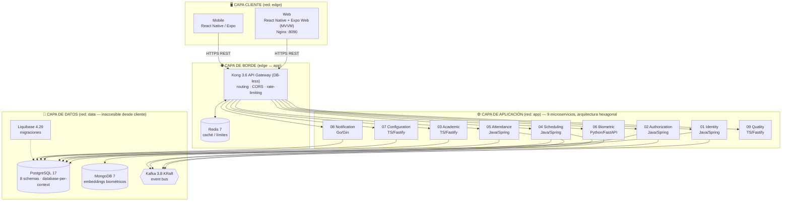
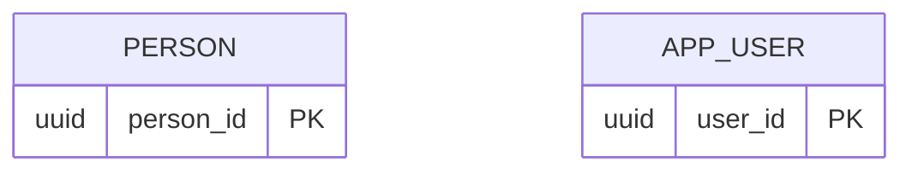
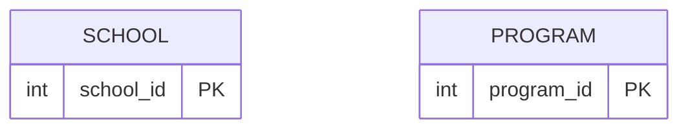
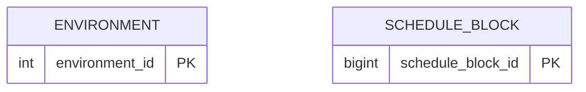
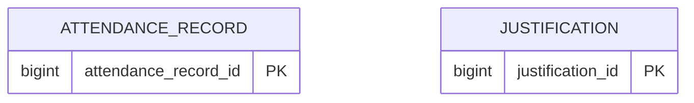
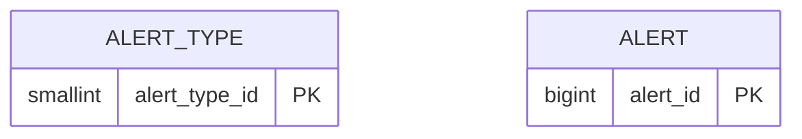
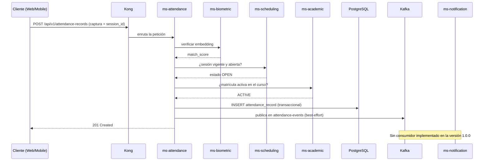

# 🎓 FaceAttend EDU

## Documentación Técnica del Sistema

| | |
|---|---|
| **Proyecto** | FaceAttend EDU — Plataforma de gestión de asistencia educativa con validación biométrica |
| **Versión** | 1.0.0 |
| **Rama de referencia** | `develop` |
| **Fecha** | Octubre 2026 |
| **Estándares aplicados** | ISO/IEC 25010 · IEEE 829 · ISTQB · ISO/IEC 29110 |

---

## 1. Introducción

**FaceAttend EDU** es una plataforma de gestión de asistencia educativa que reemplaza el registro manual de asistencia por un proceso automatizado basado en **identificación biométrica facial y dactilar**. El sistema valida la identidad de estudiantes y docentes, gestiona el ciclo académico completo (programas, cursos, horarios, sesiones y matrículas) y emite registros de asistencia auditables y trazables.

La solución está concebida como un proyecto de ingeniería de software formal: cada decisión de diseño queda documentada mediante **Architecture Decision Records (ADRs)**, los servicios se organizan por **bounded contexts** bajo DDD, y la calidad se verifica contra estándares reconocidos (ISO/IEC 25010 para atributos de calidad, IEEE 829 e ISTQB para documentación de pruebas).

## 2. Objetivo

Desarrollar e implementar una plataforma tecnológica que permita:

1. **Registrar y verificar asistencia educativa de forma biométrica** (rostro y huella dactilar), eliminando suplantación de identidad ("proxy attendance") y errores del registro manual.
2. **Gestionar el ciclo académico completo**: programas, cursos, horarios, sesiones programadas y matrícula de estudiantes.
3. **Garantizar seguridad y trazabilidad**: autenticación JWT RS256, autorización RBAC, auditoría en todas las entidades y aislamiento de red por capas.
4. **Demostrar calidad de software bajo estándares formales**, con métricas objetivas reportadas por un microservicio dedicado (ms-quality) y documentación de pruebas conforme a IEEE 829 / ISTQB.
5. **Operar de manera reproducible** mediante infraestructura como código (Docker Compose) y base de datos como código (Liquibase + scripts SQL versionados).

## 3. Alcance técnico

**Dentro del alcance:**

- Arquitectura **monolito modular políglota** con DDD (8 bounded contexts de dominio + API Gateway) y **arquitectura hexagonal** (puertos y adaptadores) dentro de cada servicio.
- **9 microservicios** especializados en Java 21, TypeScript, Python 3.12 y Go 1.22, orquestados con Docker Compose.
- **API Gateway Kong 3.6** (modo DB-less) como único punto de entrada público, con rate-limiting vía Redis.
- Persistencia: **PostgreSQL 17** multi-schema (estrategia database-per-service), **MongoDB 7** para embeddings biométricos, **Redis 7** para caché/límite de peticiones y **Kafka 3.8 (KRaft)** como event bus asíncrono.
- Migraciones versionadas con **Liquibase 4.29** y golang-migrate; modelado documental en **DBML**.
- Clientes **Web** y **Mobile** construidos con React Native + Expo (la web exportada con `expo export --platform web` y servida por Nginx), organizados bajo patrón **MVVM**.
- Segmentación de red en **3 zonas** (`edge`, `app`, `data`) como control de seguridad de infraestructura.
- Módulo de calidad con reportes ISO/IEC 25010, ISTQB, IEEE 829 e ISO 29110, y catálogo de códigos de error/calidad.

**Fuera del alcance (por ahora):**

- Integración con hardware físico de captura dactilar in situ (se trabaja sobre APIs de embeddings).
- Despliegue gestionado en la nube (Kubernetes/Terraform); el entorno objetivo actual es local/containers.
- Facturación, pagos o módulos administrativos ajenos a asistencia y ciclo académico.

## 4. Descripción técnica del sistema (resumen de la solución)

FaceAttend EDU implementa un patrón **cliente-servidor en capas** con comunicación síncrona (REST) y asíncrona (eventos):

- Los **clientes** (Web y Mobile, ambos React Native/Expo con lógica MVVM) nunca acceden directamente a los servicios ni a las bases de datos: toda petición pasa por **Kong**, que resuelve rutas, aplica CORS, límite de peticiones y delega la verificación de tokens **JWT RS256** emitidos por `ms-identity` y las reglas RBAC de `ms-authorization`.
- En la capa de aplicación, cada microservicio encapsula un bounded context: `identity` (usuarios y autenticación), `authorization` (roles/permisos), `academic` (programas, cursos, matrículas), `scheduling` (horarios y sesiones), `attendance` (registro de asistencia), `biometric` (plantillas faciales/dactilares y matching vectorial en MongoDB), `configuration` (parámetros del sistema) y `notification` (alertas y envío de correo). `quality` expone métricas de verificación del sistema.
- La **capa de datos** permanece aislada en su propia red Docker: PostgreSQL por contexto (sin claves foráneas entre contextos — solo UUIDs lógicos), MongoDB para embeddings, Kafka para eventos de dominio y Redis como soporte del gateway.
- El flujo crítico de asistencia combina ambos mundos: verificación biométrica → validación de sesión vigente y matrícula → escritura transaccional del registro → publicación del evento en el topic `attendance-events`, de forma best-effort y fuera de la transacción.
- El arranque es determinista y verificable: PostgreSQL → migraciones Liquibase → microservicios → ms-quality → Kong + Redis → frontend, encadenados con *healthchecks* de Docker Compose.

## 5. Tecnologías utilizadas

### 5.1 Lenguajes y frameworks (por componente)

| Componente | Lenguaje | Versión exacta | Framework / Librería principal | Versión |
|---|---|---|---|---|
| 01-ms-identity | Java | 21 (Eclipse Temurin) | Spring Boot | 4.1.1 |
| 02-ms-authorization | Java | 21 (Eclipse Temurin) | Spring Boot | 4.1.1 |
| 04-ms-scheduling | Java | 21 (Eclipse Temurin) | Spring Boot | 4.1.1 |
| 05-ms-attendance | Java | 21 (Eclipse Temurin) | Spring Boot | 4.1.1 |
| 03-ms-academic | TypeScript | ^5.4.0 (runtime Node 20) | Fastify + Drizzle ORM | ^4.26.0 / ^0.31.0 |
| 07-ms-configuration | TypeScript | ^5.4.0 (runtime Node 20) | Fastify + pg | ^4.26.0 / ^8.11.0 |
| 09-ms-quality | TypeScript | ^5.4.0 (runtime Node 20) | Fastify | ^4.26.0 |
| 06-ms-biometric | Python | ^3.12 | FastAPI + Uvicorn + OpenCV | ^0.110.0 / ^0.28.0 / ^4.9.0 |
| 08-ms-notification | Go | 1.22 | Gin + pgx + Zap | v1.9.1 / v5.5.0 / v1.26.0 |
| Frontend Web | JavaScript/TypeScript | TS ~6.0.3 · React 19.2.3 | React Native + Expo (`react-native-web`) | RN 0.86.3 / Expo ^57.0.20 |
| Frontend Mobile | JavaScript/TypeScript | TS ~5.9.2 · React 19.2.3 | React Native + Expo | RN 0.86.3 / Expo ~57.0.0 |

### 5.2 Bases de datos y mensajería

| Tecnología | Rol | Versión exacta |
|---|---|---|
| PostgreSQL | BD relacional multi-schema (database-per-context) | 17-alpine |
| MongoDB | Almacén de embeddings biométricos (búsqueda vectorial) | 7 |
| Redis | Caché y rate-limiting del gateway | 7-alpine |
| Apache Kafka (KRaft, sin Zookeeper) | Event bus asíncrono entre contextos | 3.8.0 |
| Liquibase | Migraciones de esquema (database-as-code) | 4.29.0 |
| golang-migrate | Migraciones del servicio de notificaciones | v4.17.0 |
| DBML | Modelado documental del esquema (`faceattend_edu_mr_v4.dbml`) | — |

### 5.3 Infraestructura, gateway y despliegue

| Tecnología | Rol | Versión exacta |
|---|---|---|
| Kong (OSS, DB-less) | API Gateway: routing, CORS, rate-limiting | 3.6 |
| Docker Compose | Orquestación local con 3 redes segmentadas | stack declarativo propio |
| Nginx | Servidor estático del bundle web (`expo export`) | 1.27-alpine |
| Node.js | Runtime de build del frontend | 20-alpine |
| Maven (wrapper mvnw) | Build de los servicios Java | 3.9 (imagen `maven:3.9-eclipse-temurin-21-alpine`) |
| Poetry | Gestión de dependencias Python (biométrico) | python ^3.12 |
| OpenTelemetry (Go) | Observabilidad en ms-notification | v1.24.0 |

### 5.4 Seguridad

| Tecnología | Rol | Versión |
|---|---|---|
| Spring Security | Autenticación/autorización en servicios Java | incluida en Spring Boot 4.1.1 |
| JWT RS256 | Tokens de sesión firmados con par de claves | librería `jjwt` (Java) |
| go-playground/validator | Validación de entrada en Go | v10.16.0 |

### 5.5 Control de versiones

| Herramienta | Versión | Uso en el proyecto |
|---|---|---|
| Git | 2.39.5 | Monorepo con ramas por ciclo de integración (`develop` como rama de trabajo); commits convencionales (`chore(compose): …`, `feat(ms-x): …`) |
| GitHub | plataforma SaaS | Hospedaje remoto, respaldo y revisión del repositorio |

## 6. Arquitectura del sistema

### 6.1 Diagrama de capas (cliente-servidor)



### 6.2 Estructura interna de cada servicio (hexagonal)

```
┌───────────────────────────────────────────────┐
│  domain/          Entidades, value objects,   │  ← regla de negocio pura,
│                   ports (interfaces)          │    sin dependencias externas
│  ┌─────────────────────────────────────────┐  │
│  │ application/  Use-cases que orquestan   │  │  ← casos de uso
│  │               el dominio                │  │
│  │  ┌───────────────────────────────────┐  │  │
│  │  │ infrastructure/adapters/          │  │  │  ← HTTP controllers,
│  │  │  http · persistence · messaging   │  │  │    JPA/Drizzle/pgx/Mongo,
│  │  └───────────────────────────────────┘  │  │    producers/consumers Kafka
│  └─────────────────────────────────────────┘  │
└───────────────────────────────────────────────┘
```

### 6.3 Explicación del flujo

**Flujo síncrono (REST a través de Kong):**

1. **Autenticación:** el cliente envía credenciales a `POST /api/v1/auth/login` → Kong enruta a **ms-identity** → valida credenciales (BCrypt) contra PostgreSQL → emite **JWT RS256** con claims de rol → **ms-authorization** define permisos RBAC asociados.
2. **Enrollment biométrico:** captura de rostro/huella → **ms-biometric** genera el embedding (vector) y lo almacena en **MongoDB**; la plantilla se vincula al estudiante vía UUID.
3. **Registro de asistencia:** docente abre sesión (**ms-scheduling**) → estudiante se verifica → **ms-attendance** coordina: *matching* biométrico (ms-biometric), validez temporal de la sesión (ms-scheduling) y matrícula activa (ms-academic) → escribe el registro transaccionalmente en PostgreSQL.

**Flujo asíncrono (eventos Kafka):**

- Cada acción relevante publica un evento de dominio en el topic de su entidad (`attendance-events`, `identity-events`, `role-events`, etc.; véase la sección 11.8).
- La publicación no bloquea el flujo transaccional: si el broker no responde, el fallo se registra como advertencia y la operación continúa.
- **Todavía no hay consumidores.** `ms-notification` (Go) no declara dependencia de Kafka: genera sus alertas a partir de las peticiones HTTP que recibe y las envía por SMTP. El bus queda preparado para incorporar consumidores sin tocar a los productores.

**Reglas transversales:**

- Entre bounded contexts solo circulan **UUIDs lógicos** (sin FK reales entre esquemas) → bajo acoplamiento.
- Auditoría estándar en todas las tablas: soft-delete, timestamps y optimistic locking.
- Seguridad por red: el cliente solo alcanza a Kong; Kong solo alcanza a la capa `app`; solo la capa `app` alcanza la red `data`.

**Orden de arranque orquestado (healthchecks):** PostgreSQL → migraciones Liquibase por contexto → microservicios → ms-quality → Kong + Redis → frontend Web.

## 7. Estructura del proyecto

### 7.1 Árbol de carpetas

```
/workspace
├── docker-compose.yml                  # Orquestación general: redes edge/app/data, healthchecks
├── COMPOSE.md                          # Documentación del entorno Docker Compose
│
├── front-end/
│   ├── Web/                            # App React Native + Expo exportada a web (react-native-web)
│   │   ├── Dockerfile                  # Build node:20 → expo export → nginx:1.27
│   │   ├── nginx.conf                  # Servido estático + SPA fallback
│   │   └── src/
│   │       ├── api/                    # Cliente HTTP base hacia Kong
│   │       ├── config/                 # Configuración de entorno (URLs, variables)
│   │       ├── context/                # Contextos globales (Auth, Theme, Responsive)
│   │       ├── core/                   # Transversal: constants, hooks, storage, theme, utils
│   │       ├── models/                 # Tipos y estructuras de datos por dominio
│   │       ├── navegation/             # React Navigation: pilas públicas/autenticadas + deep linking
│   │       ├── services/api/           # Un módulo por microservicio (authApi, academicApi, ...)
│   │       ├── view/                   # VISTA (V): components/ y screens/ (authorized/)
│   │       └── viewmodels/             # VIEWMODEL (VM): hooks con lógica de presentación
│   └── Mobile/                         # App móvil React Native + Expo
│       ├── src/
│       │   ├── api/ · services/        # Acceso HTTP a Kong
│       │   ├── assets/images/          # Recursos estáticos
│       │   ├── hooks/ · utils/         # Hooks y utilidades (locales/i18n)
│       │   ├── models/                 # Tipos por contexto: identity, academic, attendance,
│       │   │                           #   scheduling, authorization, notification, ...
│       │   ├── navigations/            # React Navigation
│       │   └── storage/                # Persistencia local (tokens JWT)
│       ├── scripts/                    # Utilidades de desarrollo
│       └── seed/                       # Datos semilla para pruebas móviles
│
├── back-end/                           # Microservicios + gateway (DDD + hexagonal)
│   ├── 01-ms-identity/                 # Java 21 / Spring Boot — usuarios y autenticación JWT
│   │   └── src/main/java/com/faceattend_edu/identity_service/
│   │       ├── domain/                 # Entidades y puertos
│   │       ├── application/            # Casos de uso
│   │       ├── adapter/                # REST controllers, JPA, Kafka
│   │       ├── config/ · shared/       # Cross-cutting (security, exceptions, audit)
│   ├── 02-ms-authorization/            # Java — roles y permisos RBAC
│   ├── 03-ms-academic/                 # TS/Fastify — programas, cursos, matrículas
│   │   └── src/{domain/{entities,ports}, application/use-cases,
│   │            infrastructure/{http,persistence,db,messaging}}
│   ├── 04-ms-scheduling/               # Java — horarios y sesiones
│   ├── 05-ms-attendance/               # Java — registro de asistencia
│   ├── 06-ms-biometric/                # Python/FastAPI — rostro/huella, embeddings → MongoDB
│   │   └── {domain/{entities,value_objects,ports}, infrastructure/{web,persistence},
│   │        tests/{unit,support}}
│   ├── 07-ms-configuration/            # TS/Fastify — parámetros del sistema
│   ├── 08-ms-notification/             # Go/Gin — alertas + correo SMTP
│   │   └── {cmd/, internal/{domain/port, application/usecase,
│   │            infrastructure/{http,postgres,config}}, migrations/}
│   ├── 09-ms-quality/                  # TS/Fastify — métricas ISO/IEC 25010 y reportes
│   ├── 99-api-gateway/kong/kong.yml    # Definición DB-less: rutas, upstreams, plugins
│   ├── quality/quality-codes.md        # Catálogo de códigos de calidad/error
│   ├── docker-compose.yml              # Stack backend (Kong, Kafka, Mongo, Redis, MSs)
│   └── *.md                            # Documentos formales: QUALITY.md, ISO25010,
│                                       #   IEEE829 (plan/casos/incidencias/resumen),
│                                       #   ISTQB, ISO29110, SERVICES.md, DATABASE.md
│
├── database/                           # Database-as-code, un directorio por contexto
│   ├── 01-ms-identity-db/ … 08-ms-notification-db/
│   │   ├── 01-ddl/                     # Tablas, índices, triggers
│   │   ├── 02-dml/                     # Seeds (datos iniciales)
│   │   ├── 03-dcl/                     # Roles, grants, seguridad
│   │   ├── 04-tcl/                     # Control transaccional
│   │   ├── 05-rollbacks/               # Scripts reversibles
│   │   └── changelog/                  # Changelogs Liquibase (changelog.xml)
│   ├── database-init/                  # Bootstrap PostgreSQL (schemas y usuarios)
│   ├── scripts/init-multidb.sql        # Inicialización multi-base de datos
│   ├── docker-compose.yml              # postgres:17-alpine + liquibase:4.29.0
│   ├── faceattend_edu_mr_v4.dbml       # Modelo relacional documental (DBML)
│   └── CONVENCIONES.md · ESTRUCTURA.md · MODELO.md · SEEDS.md
│
└── tools/
    └── seed-api-test-data/             # Cargador de datos de prueba consumiendo la API real
```

### 7.2 Tabla explicativa de carpetas principales

| Carpeta | Qué hace |
|---|---|
| `docker-compose.yml` (raíz) | Punto de entrada único del stack: define las 3 redes aisladas (`edge`, `app`, `data`), volúmenes y cadena de arranque con healthchecks. |
| `front-end/Web/src/view` | Capa **Vista (V)** del MVVM: componentes reutilizables y pantallas (públicas y `authorized/`). |
| `front-end/Web/src/viewmodels` | Capa **ViewModel (VM)**: hooks que contienen la lógica de presentación, consumen `services/api` y alimentan la vista. Es el equivalente funcional de "controllers" del lado cliente. |
| `front-end/Web/src/services/api` | Capa de acceso a datos: un módulo por microservicio; centraliza llamadas REST hacia Kong. |
| `front-end/Web/src/navegation` | Definición de navigators públicos/autenticados (React Navigation) y deep linking; no usa router web tradicional. |
| `front-end/Web/src/context` y `core` | Estado global (sesión, tema, responsive) e infraestructura transversal (storage local, constantes, utilidades). |
| `front-end/Mobile/src/models` | Tipos de datos tipados por los 8 bounded contexts, espejo contractual de los DTOs del backend. |
| `back-end/01..09-ms-*` | Un directorio por bounded context. Internamente: `domain` (entidades/puertos) → `application` (casos de uso) → `infrastructure/adapter` (HTTP, persistencia, mensajería). Aquí vive la lógica de negocio, equivalente a "backend/controllers" pero segregada por capas hexagonales. |
| `back-end/99-api-gateway/kong` | `kong.yml`: declaración DB-less de servicios upstream, rutas y plugins (rate-limiting con Redis, CORS). Único punto de exposición pública. |
| `back-end/*.md` y `back-end/quality` | Documentación formal de calidad: reportes ISO/IEC 25010, ISTQB, ISO 29110, especificación de pruebas IEEE 829 y catálogo de códigos de calidad. |
| `database/<NN>-ms-*-db/01-ddl…05-rollbacks` | SQL organizado por lenguaje (DDL/DML/DCL/TCL) con rollbacks explícitos por script: permite reproducir y revertir el esquema de cada contexto. |
| `database/<NN>-ms-*-db/changelog` | Changelogs Liquibase ejecutados automáticamente al arrancar el stack (database-as-code). |
| `database/faceattend_edu_mr_v4.dbml` | Diagrama/modelo relacional del sistema en DBML como fuente documental del esquema. |
| `tools/seed-api-test-data` | Utilitario que puebla datos de prueba end-to-end consumiendo la API real (valida contratos, no inserta SQL directo). |

---

## 8. Base de datos

### 8.1 Motores utilizados

El sistema usa **persistencia políglota**: cada tecnología cubre el tipo de dato para el que es más adecuada.

| Motor | Versión | Uso | Contenedor / Nombre |
|---|---|---|---|
| **PostgreSQL** | **17-alpine** | Datos relacionales transaccionales. Un schema por bounded context (estrategia *database-per-context* sobre una sola instancia). | **`faceattend_db`** |
| **MongoDB** | **7** | Embeddings faciales y dactilares, en dos colecciones documentales. | **`faceattend_biometric`** |
| **Redis** | **7-alpine** | Contadores de rate-limiting de Kong (no almacena datos de negocio). | — |
| **Apache Kafka (KRaft)** | **3.8.0** | Bus de eventos de dominio (solo transporta eventos; no persiste datos de negocio). | — |

**Datos de conexión (entorno de desarrollo):** host interno `postgres` (red Docker `data`), puerto **5432**. El puerto **no se publica hacia el cliente**: solo los microservicios de la red `app` pueden alcanzarlo. Cada servicio se conecta con su **propio usuario de base de datos**, con permisos únicamente sobre su schema (véase la sección 9.5).

### 8.2 Organización de la base de datos (database-per-context)

Un único servidor PostgreSQL aloja **ocho schemas**, uno por bounded context. Este diseño permite migrar cada contexto a su propio servidor en el futuro sin rediseñar el modelo.

| Schema | Microservicio dueño | Tablas | Contenido |
|---|---|---|---|
| **`identity`** | 01-ms-identity | 4 | Personas, usuarios de aplicación, sesiones y política de contraseñas |
| **`authorization`** | 02-ms-authorization | 4 | Roles, permisos y su asignación a roles y usuarios |
| **`academic`** | 03-ms-academic | 8 | Sedes, programas, periodos, fichas, cursos, actores académicos y matrículas |
| **`scheduling`** | 04-ms-scheduling | 3 | Ambientes, bloques de horario y sesiones de clase |
| **`attendance`** | 05-ms-attendance | 5 | Registros de asistencia, justificaciones, soportes y reportes |
| **`biometric`** | 06-ms-biometric | **0** | **Sin tablas relacionales.** Este contexto persiste exclusivamente en MongoDB (sección 8.4) |
| **`configuration`** | 07-ms-configuration | 3 | Parámetros académicos y de seguridad, y casos de actualización biométrica |
| **`notification`** | 08-ms-notification | 2 | Catálogo de alertas y alertas generadas |

**Reglas de diseño del modelo:**

- **Sin claves foráneas entre schemas.** Entre contextos solo viajan identificadores lógicos; por ejemplo, `attendance.attendance_record.academic_actor_id` referencia a `academic.academic_actor` sin FK física. La integridad entre contextos la garantiza la capa de aplicación. El archivo del modelo relacional marca cada una de estas referencias como *cross-context (sin FK)*.
- **La clave primaria se elige por tabla, no es uniforme.** Se usa `uuid` donde el identificador viaja entre contextos o se expone públicamente (`person`, `app_user`, `user_session`, `attendance_report`, `biometric_update_case`); se usan columnas de identidad `int`, `smallint` o `bigint` en catálogos y en tablas de alto volumen; y las dos tablas puente del schema `authorization` usan **clave primaria compuesta**.
- **Auditoría estándar en todas las tablas**, con siete columnas: `created_at`, `updated_at`, `deleted_at` (`TIMESTAMP`), `created_by`, `updated_by`, `deleted_by` (`UUID`) y `row_version` (`BIGINT`, por defecto 1) para *optimistic locking*. El borrado es siempre lógico (*soft-delete*).
- **Unicidad acotada al dueño.** Los códigos son únicos dentro de su sede o su programa, no globalmente: `uq_program_code_school`, `uq_course_code_program`, `uq_environment_code_school`, `uq_period_name_school`. El correo de una persona es único solo entre las filas vivas (`where: deleted_at IS NULL`), de modo que un soft-delete libera la dirección para reutilizarla.
- **Database-as-code:** el esquema se crea con changelogs versionados de Liquibase en `database/<NN>-ms-*-db/01-ddl`, organizados en `00-extensions`, `01-schemas`, `02-types`, `03-tables`, `05-materialized-views`, `06-functions`, `07-procedures`, `08-triggers` y `09-indexes`, cada uno con su rollback. El servicio de notificaciones usa además **golang-migrate v4.17.0**.

### 8.3 Diagramas entidad-relación

El modelo completo es `database/faceattend_edu_mr_v4.dbml`, que puede visualizarse en [dbdiagram.io](https://dbdiagram.io) y es la fuente de verdad de nombres y tipos. A continuación se presenta en cinco figuras, una por grupo de contextos. Las líneas **continuas** son claves foráneas físicas dentro de un schema; las **punteadas** son referencias lógicas entre schemas, que no llevan FK.











El schema `configuration` no tiene diagrama propio: sus tres tablas guardan parámetros y casos que no llevan claves foráneas entre sí. Se documentan en la sección 8.5.

**Relaciones clave:**

| Relación | Cardinalidad | Significado |
|---|---|---|
| `person` → `app_user` | 1:1 | Una persona tiene como máximo una cuenta de aplicación; `app_user.person_id` es único. |
| `app_user` → `user_session` | 1:N | Cada inicio de sesión abre una fila con su inicio, fin, IP de origen y estado. |
| `role` → `role_permission` ← `permission` | N:M | Base del control de acceso RBAC, con clave primaria compuesta. |
| `app_user` ⇢ `user_role` → `role` | N:M | Un usuario tiene varios roles. La referencia al usuario es lógica, porque cruza de `authorization` a `identity`. |
| `school` → `program` → `course` | 1:N | Una sede ofrece programas y cada programa contiene cursos. |
| `program` + `academic_period` → `cohort` | N:1 cada una | Una ficha es un grupo de un programa enmarcado en un periodo. |
| `person` ⇢ `academic_actor` | 1:N (lógica) | Una misma persona puede ser aprendiz en una sede e instructor en otra; `academic_actor_type` distingue el papel. |
| `academic_actor` → `enrollment` ← `cohort` | N:M | Un actor se matricula en fichas; el par es único. |
| `environment` → `schedule_block` → `class_session` | 1:N | Un bloque recurrente en un ambiente genera sesiones con fecha; el par bloque-fecha es único. |
| `class_session` ⇢ `attendance_record` ⇠ `academic_actor` | 1:N (lógica) | Un registro por actor y sesión, garantizado por `uq_attendance_session_actor`. |
| `attendance_record` → `justification` | 1:1 | Un registro admite como máximo una justificación; `attendance_record_id` es único en `justification`. |
| `justification` → `supporting_document` | 1:N | Archivos de soporte adjuntos a la justificación. |
| `alert_type` → `alert` | 1:N | El catálogo define severidad y canal; cada alerta apunta a su tipo. |

> **Nota.** El flujo de asistencia cruza, por tanto, tres schemas sin una sola clave foránea física entre ellos: la sesión vive en `scheduling`, el actor en `academic` y el registro en `attendance`.

### 8.4 Colecciones de MongoDB (embeddings biométricos)

El contexto `biometric` no tiene tablas relacionales. Persiste en dos colecciones documentales separadas, una por modalidad biométrica.

| Colección | Campo | Tipo | Descripción |
|---|---|---|---|
| **`facial_embedding`** | `person_id` | string (UUID) | Dueño de la plantilla; es la referencia lógica a `identity.person`. |
| | `template_version` | int | Versión de la plantilla, que permite reenrolar sin perder historial. |
| | `encoding` | array\<double\> | Vector de características extraído del rostro. |
| | `model_version` | string | Versión del modelo que produjo el vector. |
| | `enrolled_at` | date | Fecha de enrolamiento. |
| | `is_active` | boolean | Marca la plantilla vigente. |
| **`fingerprint_embedding`** | `person_id` | string (UUID) | Dueño de la plantilla. |
| | `finger_number` | int | Dedo enrolado, de 1 a 10. |
| | `template_version` | int | Versión de la plantilla. |
| | `encoding` | array\<double\> | Vector de características extraído de la huella. |
| | `model_version` | string | Versión del modelo que produjo el vector. |
| | `enrolled_at` | date | Fecha de enrolamiento. |
| | `is_active` | boolean | Marca la plantilla vigente. |

El enlace desde el lado relacional es `configuration.biometric_update_case.current_embedding_ref`, que guarda el identificador del documento como texto libre. Deliberadamente **no** es una clave foránea real, porque la referencia cruza de paradigma, de SQL a NoSQL.

Los embeddings **no son imágenes**: a partir del vector no se puede reconstruir el rostro ni la huella original, lo que reduce el riesgo de privacidad ante una filtración.

### 8.5 Diccionario de datos

Todas las tablas que se relacionan a continuación llevan además las siete **columnas de auditoría** descritas en la sección 8.2 (`created_at`, `updated_at`, `deleted_at`, `created_by`, `updated_by`, `deleted_by`, `row_version`), que no se repiten en cada entrada.

**Schema `identity`**

| Tabla | Clave primaria | Columnas de negocio | Propósito |
|---|---|---|---|
| `person` | `person_id` uuid | `document_number`, `document_type`, `name`, `last_name`, `email`, `phone`, `blood_type`, `birth_date`, `address`, `status` | Persona natural. Única por tipo y número de documento; el correo es único entre filas vivas. |
| `app_user` | `user_id` uuid | `person_id` (único), `username` (único), `password_hash`, `authentication_type`, `status`, `last_access` | Cuenta de acceso. `authentication_type` admite Local, Windows o External. |
| `user_session` | `session_id` uuid | `user_id`, `start_date`, `end_date`, `source_ip`, `session_status` | Sesión abierta por un usuario. `session_status` es Active o Closed. |
| `password_policy` | `policy_id` int | `min_length`, `max_length`, `requires_uppercase`, `requires_numbers`, `requires_symbols`, `expiration_days` | Reglas de contraseña aplicadas al registrar y al cambiar. |

**Schema `authorization`**

| Tabla | Clave primaria | Columnas de negocio | Propósito |
|---|---|---|---|
| `role` | `role_id` int | `role_name` (único), `description` | Rol del modelo RBAC. |
| `permission` | `permission_id` int | `permission_name` (único), `description` | Permiso individual. |
| `role_permission` | (`role_id`, `permission_id`) | `assignment_date` | Permisos concedidos a un rol. |
| `user_role` | (`user_id`, `role_id`) | `assignment_date` | Roles asignados a un usuario. `user_id` es referencia lógica a `identity.app_user`. |

**Schema `academic`**

| Tabla | Clave primaria | Columnas de negocio | Propósito |
|---|---|---|---|
| `school` | `school_id` int | `code` (único), `name`, `city_id`, `city_name`, `district`, `country`, `address`, `phone`, `email`, `status` | Centro de formación. `city_id` apunta a un catálogo externo y no lleva FK. |
| `program` | `program_id` int | `school_id`, `code`, `name`, `status` | Programa de formación. El código es único dentro de su sede. |
| `academic_period` | `academic_period_id` int | `school_id`, `name`, `starts_on`, `ends_on`, `is_active` | Periodo sobre el que se consolidan los reportes. |
| `cohort` | `cohort_id` bigint | `program_id`, `academic_period_id`, `code` (único), `status` | Ficha: grupo de un programa dentro de un periodo. |
| `course` | `course_id` int | `program_id`, `code`, `name`, `credit_hours`, `status` | Curso o competencia. El código es único dentro de su programa. |
| `academic_actor_type` | `actor_type_id` smallint | `code` (único), `name` | Catálogo de tipos de actor: STUDENT e INSTRUCTOR. |
| `academic_actor` | `academic_actor_id` bigint | `person_id`, `actor_type_id`, `school_id`, `actor_code`, `started_on`, `ended_on`, `status` | Persona actuando en una sede bajo un tipo dado. Única por sede, tipo y código. |
| `enrollment` | `enrollment_id` bigint | `academic_actor_id`, `cohort_id`, `enrolled_on`, `enrollment_status` | Matrícula de un actor en una ficha. Estado: Active, Withdrawn o Completed. |

**Schema `scheduling`**

| Tabla | Clave primaria | Columnas de negocio | Propósito |
|---|---|---|---|
| `environment` | `environment_id` int | `school_id`, `code`, `name`, `capacity`, `status` | Ambiente o salón. El código es único dentro de su sede. |
| `schedule_block` | `schedule_block_id` bigint | `cohort_id`, `course_id`, `environment_id`, `instructor_actor_id`, `day_of_week`, `starts_at`, `ends_at` | Franja recurrente. Dos índices únicos impiden que un ambiente o un instructor queden asignados dos veces en la misma franja. |
| `class_session` | `class_session_id` bigint | `schedule_block_id`, `session_date`, `opened_by`, `opened_at`, `closed_by`, `closed_at`, `session_status` | Instancia con fecha de un bloque. Estado: Open, Closed o Cancelled. Única por bloque y fecha. |

**Schema `attendance`**

| Tabla | Clave primaria | Columnas de negocio | Propósito |
|---|---|---|---|
| `attendance_record` | `attendance_record_id` bigint | `class_session_id`, `academic_actor_id`, `attendance_status`, `captured_at`, `capture_method`, `match_score` | Asistencia de un actor en una sesión. Estado: Present, Absent, Late o Justified. Método: FACIAL, MANUAL, IOT o IMPORT. |
| `justification_type` | `justification_type_id` int | `school_id`, `name`, `description`, `requires_attachment`, `status` | Catálogo de tipos de justificación. Un `school_id` nulo marca un tipo global. |
| `justification` | `justification_id` bigint | `attendance_record_id` (único), `justification_type_id`, `reason`, `submitted_at`, `reviewed_by`, `reviewed_at`, `review_status`, `resolution_notes` | Justificación de una inasistencia. Estado: Pending, Approved o Rejected. |
| `supporting_document` | `supporting_document_id` bigint | `justification_id`, `file_name`, `storage_uri`, `mime_type`, `size_bytes` | Archivo de soporte adjunto a una justificación. |
| `attendance_report` | `report_id` uuid | `school_id`, `cohort_id`, `generated_by`, `report_type`, `filters` (jsonb), `result` (jsonb), `generated_at` | Reporte generado, con sus filtros y su resultado almacenados como JSON. |

**Schema `configuration`**

| Tabla | Clave primaria | Columnas de negocio | Propósito |
|---|---|---|---|
| `academic_configuration` | `configuration_id` int | `school_id`, `configuration_name`, `configuration_value`, `description` | Parámetro académico por sede, por ejemplo `tardy_tolerance_minutes`. Único por sede y nombre. |
| `security_configuration` | `configuration_id` int | `configuration_name` (único), `configuration_value`, `description` | Parámetro global de seguridad. |
| `biometric_update_case` | `case_id` uuid | `person_id`, `biometric_type`, `finger_number`, `current_embedding_ref`, `reason`, `update_status`, `requested_by`, `requested_at`, `reviewed_by`, `reviewed_at`, `resolution_notes` | Solicitud de reenrolamiento de una plantilla biométrica. Un CHECK exige `finger_number` entre 1 y 10 cuando el tipo es FINGERPRINT y nulo cuando es FACIAL. |

**Schema `notification`**

| Tabla | Clave primaria | Columnas de negocio | Propósito |
|---|---|---|---|
| `alert_type` | `alert_type_id` smallint | `code` (único), `name`, `severity`, `channel` | Catálogo de alertas. Severidad: INFO, WARNING o CRITICAL. Canal: DASHBOARD, EMAIL o PUSH. |
| `alert` | `alert_id` bigint | `academic_actor_id`, `alert_type_id`, `raised_at`, `resolved_at` | Alerta generada para un actor y su resolución. |

### 8.6 Divergencias entre el modelo y el esquema implementado

El archivo del modelo relacional y los changelogs de Liquibase no cubren exactamente el mismo conjunto de tablas. La diferencia importa al leer el esquema, así que queda registrada aquí.

| Divergencia | Detalle |
|---|---|
| `identity.city` | Los changelogs siguen creando esta tabla; el archivo del modelo la eliminó en la revisión v6, cuando el catálogo de ciudades pasó a una API externa consumida a través de `school.city_id` y `school.city_name`. |
| Tablas de calidad | Los changelogs de `configuration` crean además `quality_project`, `quality_evaluation`, `quality_evaluation_item`, `process_assessment`, `process_assessment_rating`, `istqb_assessment` e `istqb_assessment_item`, que sustentan los reportes de `09-ms-quality` y no forman parte del archivo del modelo relacional. |
| Totales | El archivo del modelo declara **29 tablas**; los changelogs crean **37**, siendo las ocho anteriores la diferencia. |

Antes de dar por buenos un nombre o un tipo, consúltese `database/faceattend_edu_mr_v4.dbml` para las tablas modeladas y los changelogs de `database/<NN>-ms-*-db/01-ddl/03-tables` para lo que efectivamente se crea.

---

## 9. Seguridad

La seguridad se aplica en **capas** (defensa en profundidad): red, gateway, autenticación, autorización, datos y auditoría.

### 9.1 Autenticación (JWT RS256)

1. El cliente envía sus credenciales a `POST /api/v1/auth/login` a través de Kong.
2. **ms-identity** busca al usuario y compara la contraseña con el hash **BCrypt** almacenado.
3. Si es válida, emite un **JWT firmado con RS256** (algoritmo asimétrico): firma con la **clave privada** (solo la conoce ms-identity) y los demás servicios verifican con la **clave pública**.
4. El token incluye *claims* de identidad y rol (`sub`, `roles`, `iat`, `exp`).
5. El cliente envía el token en cada petición: `Authorization: Bearer <token>`.

| Parámetro | Valor |
|---|---|
| Algoritmo de firma | **RS256** (RSA + SHA-256) |
| Librería | **jjwt** (Java) |
| Vigencia del *access token* | **15 minutos** |
| Vigencia del *refresh token* | **7 días** |
| Almacenamiento en el cliente | **Web:** almacenamiento local del navegador · **Mobile:** almacenamiento local en `src/storage` |

**Por qué RS256 y no HS256:** con HS256 todos los servicios compartirían un secreto capaz de *firmar* tokens; con RS256 solo ms-identity puede emitirlos y el resto únicamente puede verificarlos, de modo que comprometer un servicio de consumo no permite falsificar sesiones.

### 9.2 Cifrado de contraseñas

- Las contraseñas se guardan con **BCrypt** (función de hash adaptativa con *salt* aleatorio por usuario), con factor de costo **10** (valor por defecto de Spring Security `BCryptPasswordEncoder`).
- Nunca se almacena ni se registra en logs la contraseña en texto plano; el campo `password_hash` jamás se devuelve en las respuestas de la API.
- El hash no es reversible: para validar, se hashea el valor ingresado y se compara.

### 9.3 Autorización por roles (RBAC)

- **ms-authorization** define los roles (**ADMIN, TEACHER, STUDENT**) y los permisos asociados a cada uno (modelo `roles` ↔ `permissions`, sección 8.3).
- Cada microservicio Java valida la firma del JWT con **Spring Security** y comprueba que el rol/permiso del token autorice la operación solicitada. Los servicios en TypeScript, Python y Go realizan la misma verificación con la clave pública.

| Rol | Alcance (resumen) |
|---|---|
| **ADMIN** | Gestión de usuarios, roles, programas, cursos, configuración y consulta de calidad. |
| **TEACHER** | Abrir/cerrar sesiones de sus cursos y consultar la asistencia de sus cursos. |
| **STUDENT** | Registrar su asistencia y consultar únicamente su propio historial. |

### 9.4 Medidas para que un usuario no acceda a datos ajenos

| Medida | Cómo se aplica |
|---|---|
| **Autorización por rol** | Cada endpoint exige un rol/permiso mínimo; un `STUDENT` no puede invocar operaciones de `TEACHER` ni `ADMIN`. |
| **Filtrado por propietario** | Las consultas toman la identidad desde el `sub` del token (no desde un parámetro enviable por el cliente), de modo que un estudiante solo ve sus propios registros. |
| **Un solo punto de entrada** | El cliente solo alcanza **Kong**; los microservicios y las bases de datos no son accesibles desde fuera. |
| **Segmentación de red en 3 zonas** | `edge` (cliente ↔ Kong), `app` (Kong ↔ microservicios) y `data` (solo microservicios ↔ bases de datos). Un cliente no puede llegar a la red `data`. |
| **Rate-limiting (Kong + Redis)** | Limita el número de peticiones por consumidor/IP, mitigando fuerza bruta y abuso de la API. |
| **CORS restringido** | Kong solo acepta orígenes autorizados (el frontend web). |
| **Validación de entrada** | Validación de DTOs en cada servicio (Bean Validation en Java, esquemas en Fastify, Pydantic en FastAPI, `validator` v10 en Go). |
| **Consultas parametrizadas** | JPA, Drizzle y pgx usan *prepared statements*, previniendo inyección SQL. |
| **Aislamiento de datos por servicio** | Cada microservicio solo tiene credenciales sobre su propio schema; no puede leer tablas de otro contexto. |
| **Soft-delete y auditoría** | Los registros no se borran físicamente (`deleted_at`) y todo cambio queda con autor y fecha (`created_by`, `updated_by`). |

### 9.5 Seguridad en la base de datos

- **Usuarios por servicio (DCL):** los scripts de `database/<NN>-ms-*-db/03-dcl` crean un rol de base de datos por microservicio con privilegios mínimos (`SELECT/INSERT/UPDATE/DELETE` solo sobre su schema; sin `SUPERUSER` ni `CREATE DB`).
- **Usuario de migraciones separado:** Liquibase usa un usuario propio con permisos DDL; los servicios en ejecución **no** tienen permisos DDL.
- **Secretos fuera del código:** las contraseñas de BD, claves JWT y credenciales se inyectan mediante **variables de entorno / archivo `.env`** (excluido del control de versiones con `.gitignore`).
- **Datos biométricos:** solo se almacenan **vectores (embeddings)**, no imágenes del rostro ni de la huella.
- **Integridad concurrente:** el campo `version` (*optimistic locking*) evita sobrescrituras simultáneas.

## 10. Mantenimiento

### 10.1 Respaldo (backup) y restauración

| Elemento | Qué respaldar | Herramienta | Frecuencia recomendada |
|---|---|---|---|
| **PostgreSQL** | Todos los schemas de `faceattend_edu` | `pg_dump` (formato custom) | **Diario** (completo) |
| **MongoDB** | Colección `biometric_embeddings` | `mongodump` | **Diario** |
| **Claves JWT y `.env`** | Par de claves RSA y variables de entorno | Copia cifrada en almacenamiento seguro | Al generarlas / rotarlas |
| **Código y scripts** | Repositorio (incluye `database/` con DDL y rollbacks) | Git + GitHub | En cada *push* |

**Pasos para respaldar PostgreSQL (Docker Compose):**

```bash
# 1. Generar el respaldo desde el contenedor
docker compose exec -T postgres pg_dump -U <usuario_admin> -Fc faceattend_edu > backup_$(date +%F).dump

# 2. Verificar que el archivo no esté vacío y copiarlo a un lugar externo
ls -lh backup_$(date +%F).dump
```

**Pasos para respaldar MongoDB:**

```bash
docker compose exec -T mongo mongodump --db faceattend_biometric --archive --gzip > mongo_$(date +%F).gz
```

**Pasos para restaurar:**

```bash
# PostgreSQL
docker compose exec -T postgres pg_restore -U <usuario_admin> -d faceattend_edu --clean < backup_AAAA-MM-DD.dump

# MongoDB
docker compose exec -T mongo mongorestore --archive --gzip < mongo_AAAA-MM-DD.gz
```

**Buenas prácticas:**

- Aplicar la regla **3-2-1**: 3 copias, en 2 medios distintos, 1 fuera del sitio.
- **Probar la restauración** periódicamente en un entorno aparte; un respaldo no verificado no es un respaldo.
- Mantener **retención** de al menos **30 días** de respaldos diarios.
- Respaldar PostgreSQL y MongoDB en el **mismo momento**, ya que `biometric_templates.mongo_ref` enlaza ambos.
- Los cambios de esquema se revierten con los scripts de `05-rollbacks` o con `liquibase rollback`, sin necesidad de restaurar un respaldo completo.

### 10.2 Actualización de dependencias y vulnerabilidades

| Stack | Servicios | Comando de revisión | Acción |
|---|---|---|---|
| **Node.js / TypeScript** | ms-academic, ms-configuration, ms-quality, frontends | `npm audit` · `npm outdated` | `npm audit fix` / `npm update` |
| **Java / Maven** | ms-identity, ms-authorization, ms-scheduling, ms-attendance | `./mvnw versions:display-dependency-updates` | Actualizar versiones en `pom.xml` |
| **Python / Poetry** | ms-biometric | `poetry show --outdated` | `poetry update` |
| **Go** | ms-notification | `go list -u -m all` | `go get -u ./...` y `go mod tidy` |
| **Imágenes Docker** | Todo el stack | `docker compose pull` | Reconstruir con `docker compose build --no-cache` |

**Recomendaciones:**

- Revisar vulnerabilidades **al menos una vez por mes** y siempre antes de una entrega.
- Actualizar primero las versiones *patch/minor*; las *major* (ej. Spring Boot, Expo) requieren probar el sistema completo con la batería de pruebas de ms-quality.
- Después de cada actualización: ejecutar las pruebas, levantar el stack con `docker compose up --build` y validar los *healthchecks*.
- **Rotar las claves JWT** (par RSA) periódicamente (**cada 6 meses** o ante sospecha de compromiso); esto invalida las sesiones activas.
- Cambiar las contraseñas por defecto de los entornos de desarrollo antes de cualquier despliegue real.

### 10.3 Monitoreo y soporte

- **Estado del sistema:** `docker compose ps` y los *healthchecks* de cada contenedor; **ms-quality** expone métricas de verificación.
- **Logs:** `docker compose logs -f <servicio>` (el servicio de notificaciones usa Zap con observabilidad OpenTelemetry).
- **Tabla de errores:** el catálogo `back-end/quality/quality-codes.md` permite identificar rápidamente el origen de un fallo.
- **Incidencias:** registrar los incidentes según el formato IEEE 829 (`back-end/*incidencias*.md`).
- **Soporte técnico:** reportar los problemas mediante *issues* en el repositorio de GitHub, adjuntando logs, versión (**1.0.0**) y pasos para reproducir.

---
> **Nota sobre esta versión.** Este documento es la **versión completada** del manual técnico. Las secciones 1 a 10 corresponden al documento original. Las secciones **11 a 16** (interfaz de programación, pruebas y aseguramiento de calidad, despliegue y entornos, convenciones de desarrollo y control de versiones, glosario y referencias) fueron redactadas para terminar el manual, a partir de la información declarada en las secciones previas y en los documentos del repositorio allí citados. Todas las afirmaciones técnicas se contrastaron contra el repositorio el 7 de octubre de 2026. Esa verificación corrigió la sección de Kafka: los topics reales son canales `*-events` por entidad y ningún servicio los consume todavía, por lo que las secciones 4 y 6.3 del texto original se ajustaron para coincidir con el código.

---

## 11. Interfaz de programación (API)

### 11.1 Convenciones generales

Toda la API se expone a través de **Kong** en un único punto de entrada. Los clientes nunca invocan un microservicio directamente.

| Aspecto | Convención |
|---|---|
| Punto de entrada | `http://<host>:8080` (puerto de proxy de Kong) |
| Prefijo de versión | `/api/v1/...` — toda ruta válida comienza con este prefijo |
| Formato de intercambio | JSON (`Content-Type: application/json`) |
| Autenticación | Cabecera `Authorization: Bearer <token>`; se exceptúa `POST /api/v1/auth/login` |
| Identificadores | **UUID v4** en todos los recursos; nunca enteros autoincrementales |
| Fechas y horas | ISO 8601 con zona (`timestamptz`), por ejemplo `2026-10-07T08:30:00-05:00` |
| Paginación | Parámetros `page` (base 0) y `size`; la respuesta incluye `totalElements` y `totalPages` |
| Filtrado y orden | Parámetros de consulta por campo y `sort=<campo>,<asc\|desc>` |
| Borrado | **Lógico** (`DELETE` marca `deleted_at`); no hay borrado físico desde la API |
| Concurrencia | Campo `version` en el cuerpo de las operaciones de actualización (*optimistic locking*) |

### 11.2 Verbos y códigos de estado

| Verbo | Uso | Código de éxito |
|---|---|---|
| `GET` | Consulta de uno o varios recursos | `200 OK` |
| `POST` | Creación de un recurso | `201 Created` (cabecera `Location`) |
| `PUT` | Reemplazo completo del recurso | `200 OK` |
| `PATCH` | Actualización parcial | `200 OK` |
| `DELETE` | Borrado lógico | `204 No Content` |

| Código | Significado en el sistema |
|---|---|
| `400 Bad Request` | Validación de DTO fallida (campo ausente, formato inválido). |
| `401 Unauthorized` | Token ausente, expirado o con firma inválida. **Lo emite el microservicio de destino**, no Kong. |
| `403 Forbidden` | Token válido pero el rol no posee el permiso RBAC requerido. |
| `404 Not Found` | El recurso no existe o fue borrado lógicamente. |
| `409 Conflict` | Violación de unicidad (correo o documento duplicado) o conflicto de versión. |
| `422 Unprocessable Entity` | Regla de negocio incumplida (p. ej. registrar asistencia en una sesión cerrada). |
| `429 Too Many Requests` | Límite de peticiones de Kong excedido (contador en Redis). |
| `500 Internal Server Error` | Error no controlado; se registra con identificador de correlación. |
| `502 Bad Gateway` | El microservicio de destino aún no está *healthy*. |
| `503 Service Unavailable` | Dependencia caída (base de datos o Kafka). |

### 11.3 Formato de error

Todos los servicios responden los errores con la misma estructura, de modo que el cliente puede tratarlos de forma uniforme:

```json
{
  "timestamp": "2026-10-07T08:30:00-05:00",
  "status": 409,
  "code": "IDENTITY-409-002",
  "message": "El número de documento ya está registrado",
  "path": "/api/v1/persons",
  "correlationId": "7f3a9c54-0c21-4f0e-9b2a-1d8e6f4b5c77"
}
```

El campo `code` sigue el patrón `<CONTEXTO>-<HTTP>-<SECUENCIA>` y está catalogado en `back-end/quality/quality-codes.md`, que es la fuente de verdad para la interpretación de fallos.

### 11.4 Autenticación y renovación de sesión

| Extremo | Verbo | Descripción |
|---|---|---|
| `/api/v1/auth/login` | `POST` | Recibe `identifier` y `password`; devuelve el *access token*, el *refresh token* y los datos del usuario. Único extremo público. |
| `/api/v1/auth/refresh` | `POST` | Intercambia un *refresh token* vigente por un nuevo *access token*. |
| `/api/v1/auth/logout` | `POST` | Invalida la sesión en curso. |
| `/api/v1/auth/evaluate` | `POST` | Expuesto por **ms-authorization**; evalúa si el token presentado autoriza una acción concreta. |

```bash
# Inicio de sesión
curl -X POST http://localhost:8080/api/v1/auth/login \
  -H "Content-Type: application/json" \
  -d '{"identifier":"admin.faceattend","password":"Admin123!ChangeMe"}'

# Uso del token en un extremo protegido
curl http://localhost:8080/api/v1/persons \
  -H "Authorization: Bearer <access_token>"
```

**Vigencias:** *access token* 15 minutos; *refresh token* 7 días (sección 9.1).

### 11.5 Mapa de rutas por contexto

| Microservicio | Rutas principales |
|---|---|
| 01 identity | `/api/v1/auth`, `/api/v1/persons`, `/api/v1/users`, `/api/v1/sessions`, `/api/v1/cities`, `/api/v1/password-policies` |
| 02 authorization | `/api/v1/roles`, `/api/v1/permissions`, `/api/v1/auth/evaluate`, `/api/v1/users/{id}/roles` |
| 03 academic | `/api/v1/schools`, `/api/v1/programs`, `/api/v1/academic-periods`, `/api/v1/cohorts`, `/api/v1/courses`, `/api/v1/academic-actors`, `/api/v1/enrollments` |
| 04 scheduling | `/api/v1/environments`, `/api/v1/schedule-blocks`, `/api/v1/class-sessions` |
| 05 attendance | `/api/v1/attendance-records`, `/api/v1/justifications`, `/api/v1/justification-types`, `/api/v1/supporting-documents` |
| 06 biometric | `/api/v1/biometric` (enrolamiento y verificación) |
| 07 configuration | `/api/v1/academic-configurations`, `/api/v1/security-configurations`, `/api/v1/biometric-update-cases` |
| 08 notification | `/api/v1/alert-types`, `/api/v1/alerts` |
| 09 quality | `/api/v1/quality`, `/health/quality` |

### 11.6 Extremos de salud

| Tecnología | Ruta de salud |
|---|---|
| Spring Boot (identity) | `/api/v1/health` |
| Spring Boot (scheduling, attendance, authorization) | `/actuator/health` |
| Fastify (academic, configuration, quality) | `/health` |
| FastAPI (biometric) | `/health` · documentación interactiva en `/docs` |
| Gin (notification) | `/health` |

Los servicios Java publican además su documentación OpenAPI en `/swagger-ui.html`.

### 11.7 Flujo de registro de asistencia (secuencia completa)



### 11.8 Eventos de dominio (Kafka)

| Topic | Productor | Eventos que transporta |
|---|---|---|
| `identity-events` | 01 ms-identity | Creación y modificación de personas, usuarios, credenciales y sesiones |
| `city-events` | 01 ms-identity | Cambios en el catálogo de ciudades |
| `password-policy-events` | 01 ms-identity | Cambios en las políticas de contraseña |
| `role-events` | 02 ms-authorization | Creación, modificación y asignación de roles |
| `permission-events` | 02 ms-authorization | Cambios en permisos y en la matriz rol-permiso |
| `environment-events` | 04 ms-scheduling | Registro y modificación de ambientes |
| `schedule-block-events` | 04 ms-scheduling | Cambios en los bloques de horario |
| `class-session-events` | 04 ms-scheduling | Apertura, cierre y cancelación de sesiones de clase |
| `attendance-events` | 05 ms-attendance | Registros de asistencia creados o ajustados |
| `justification-events` | 05 ms-attendance | Radicación y resolución de justificaciones |
| `justification-type-events` | 05 ms-attendance | Cambios en el catálogo de tipos de justificación |
| `document-events` | 05 ms-attendance | Soportes adjuntos a una justificación |

La publicación es **best-effort y no bloqueante**: el publicador captura cualquier fallo, lo registra como advertencia en el log y deja que la transacción concluya. Un broker inalcanzable nunca impide, por tanto, que se escriba un registro de asistencia.

> **Estado actual del consumo.** Ningún servicio se suscribe todavía a estos topics. `ms-notification` no declara dependencia de Kafka: expone sus alertas por HTTP y envía correo directamente por SMTP. El bus es, en consecuencia, de solo publicación en la versión 1.0.0, y existe para que se puedan añadir consumidores sin modificar los productores. Toda afirmación de que las notificaciones se disparan por consumo de eventos describe el diseño previsto, no el comportamiento del código actual.

---

## 12. Pruebas y aseguramiento de la calidad

### 12.1 Marco normativo aplicado

| Estándar | Qué aporta al proyecto | Evidencia en el repositorio |
|---|---|---|
| **ISO/IEC 25010** | Modelo de calidad del producto: características y subcaracterísticas evaluadas. | `back-end/ISO25010*.md`, métricas de `ms-quality` |
| **IEEE 829** | Formatos de documentación de pruebas: plan, especificación de casos, reporte de incidencias y resumen. | `back-end/IEEE829*.md` |
| **ISTQB** | Terminología, niveles y tipos de prueba; técnicas de diseño de casos. | `back-end/ISTQB*.md` |
| **ISO/IEC 29110** | Perfil de ciclo de vida para equipos muy pequeños (VSE): gestión de proyecto e implementación de software. | `back-end/ISO29110*.md` |

### 12.2 Características de calidad evaluadas (ISO/IEC 25010)

| Característica | Cómo se atiende en FaceAttend EDU |
|---|---|
| **Adecuación funcional** | Cobertura de los requisitos funcionales RF1–RF8; validación por casos de prueba IEEE 829. |
| **Eficiencia de desempeño** | Tiempo de respuesta de los extremos críticos; límite de peticiones en Kong; índices en PostgreSQL. |
| **Compatibilidad** | API REST versionada; clientes Web y Mobile desde una misma base de código (Expo). |
| **Usabilidad** | Patrón MVVM, temas accesibles, modos para daltonismo y evaluador de contraste WCAG en el cliente. |
| **Fiabilidad** | *Healthchecks*, reintentos de arranque, borrado lógico y *optimistic locking*. |
| **Seguridad** | JWT RS256, RBAC, BCrypt, segmentación de red en 3 zonas, usuarios de BD por servicio (sección 9). |
| **Mantenibilidad** | DDD + arquitectura hexagonal, ADRs, database-as-code, catálogo de códigos de error. |
| **Portabilidad** | Todo el stack se levanta con Docker Compose; sin dependencias del sistema anfitrión. |

### 12.3 Niveles y tipos de prueba (ISTQB)

| Nivel | Alcance | Herramientas por stack |
|---|---|---|
| **Unitaria** | Entidades, *value objects* y casos de uso, sin infraestructura. | JUnit 5 + Mockito (Java) · Vitest/Jest (TS) · pytest (Python, `tests/unit`) · `testing` + testify (Go) |
| **Integración** | Adaptadores de persistencia y mensajería contra motores reales. | Spring Boot Test · Testcontainers ^10.4.0 (declarado en `03-ms-academic`, aún sin usar en pruebas) · pytest con fixtures (`tests/support`) |
| **De componente / API** | Contrato de cada microservicio a través de su puerto HTTP. | Postman/Insomnia · `curl` · colecciones de verificación |
| **De sistema (E2E)** | Flujo completo a través de Kong, con datos reales de la API. | `tools/seed-api-test-data` (carga por API, valida contratos) |
| **De aceptación** | Verificación de los RF por parte del instructor evaluador. | Casos IEEE 829 con resultado esperado documentado |

**Tipos de prueba aplicados:** funcionales (positivas y negativas), de seguridad (autenticación, autorización, aislamiento de red —prueba 5 del manual de instalación—), de rendimiento básico, de regresión tras cada despliegue y de migración de base de datos (aplicación y *rollback*).

### 12.4 Documentación de pruebas (IEEE 829)

| Documento | Contenido | Archivo |
|---|---|---|
| Plan de pruebas | Alcance, estrategia, criterios de entrada y salida, riesgos, cronograma. | `back-end/IEEE829-plan*.md` |
| Especificación de casos | Identificador, precondiciones, datos, pasos, resultado esperado, trazabilidad al RF. | `back-end/IEEE829-casos*.md` |
| Reporte de incidencias | Identificador, severidad, prioridad, pasos para reproducir, evidencia, estado. | `back-end/IEEE829-incidencias*.md` |
| Resumen de pruebas | Ejecutados, aprobados, fallidos, bloqueados; conclusión sobre la liberación. | `back-end/IEEE829-resumen*.md` |

**Criterio de salida:** no se libera una versión con incidencias de severidad **crítica** o **mayor** abiertas, ni con la cadena de migraciones en estado fallido.

### 12.5 El microservicio de calidad (`09-ms-quality`)

`ms-quality` no participa en el negocio: es un **instrumento de verificación** que expone métricas objetivas del sistema.

| Función | Detalle |
|---|---|
| Consolidación de métricas | Expone indicadores ISO/IEC 25010 calculados sobre el estado real del stack. |
| Verificación de disponibilidad | `/health/quality` a través de Kong confirma la cadena completa gateway → servicio. |
| Reportería de calidad | Entrega los datos que alimentan los reportes ISO 25010, ISTQB, IEEE 829 e ISO 29110. |
| Catálogo de códigos | Referencia cruzada con `back-end/quality/quality-codes.md` para interpretar fallos. |

### 12.6 Datos de prueba

La carga de datos se realiza **siempre a través de la API real**, nunca con `INSERT` directo:

```bash
cd tools/seed-api-test-data
npm run seed
```

Este enfoque valida los contratos de la API en el mismo acto de poblar el sistema y es **idempotente**: detecta los registros preexistentes y no los duplica.

---

## 13. Despliegue y entornos

### 13.1 Entornos previstos

| Entorno | Propósito | Características |
|---|---|---|
| **Local / desarrollo** | Trabajo diario del equipo y evaluación. | Docker Compose completo; credenciales de desarrollo; `BIND_IP=127.0.0.1`. |
| **Pruebas / demostración** | Validación funcional y muestra del sistema. | Mismo stack con datos semilla cargados por API; puertos abiertos solo lo necesario. |
| **Producción** | Fuera del alcance actual (sección 3). | Requeriría dominio público, TLS, alta disponibilidad y gestor de secretos. |

### 13.2 Topología de redes Docker

| Red | Quién la integra | Quién puede alcanzarla |
|---|---|---|
| `faceattend-edge` | `frontend-web`, `kong-gateway` | El navegador del usuario. |
| `faceattend-app` | `kong-gateway`, `redis`, los 9 microservicios | Solo Kong y los microservicios entre sí. |
| `faceattend-data` | `postgres`, `mongodb`, `kafka`, las 8 migraciones | **Únicamente** la capa `app`. Inalcanzable desde el cliente. |

Esta separación es un **control de seguridad verificable**: la quinta prueba del manual de instalación comprueba que `frontend-web` no puede resolver el nombre `postgres`.

### 13.3 Cadena de arranque y healthchecks

| Fase | Componentes | Condición para avanzar |
|---|---|---|
| 1 | `postgres` | Responde a su *healthcheck* (`pg_isready`). |
| 2 | 8 contenedores Liquibase (identity → authorization → academic → scheduling → attendance → biometric → configuration → notification) | Cada migración concluye con código de salida 0. |
| 3 | Los 9 microservicios | Cada uno espera su propia migración y la BD saludable. |
| 4 | `kong-gateway` + `redis` | Espera a Redis, Kafka y los 8 microservicios principales. |
| 5 | `frontend-web` | Espera a que Kong esté saludable. |

Si una migración falla, la cadena se detiene: **los logs de las migraciones son siempre el primer lugar a revisar**.

### 13.4 Variables de entorno relevantes

La configuración completa reside en un único archivo `.env` en la raíz de `FULL/`. El manual de instalación documenta la totalidad de las variables; las de mayor impacto técnico son:

| Variable | Efecto técnico |
|---|---|
| `BIND_IP` | Dirección de *binding* de los puertos internos. `127.0.0.1` mantiene la capa de datos inaccesible desde la red local. |
| `EXPO_PUBLIC_API_URL` | Se **incrusta en el bundle** durante el build; cambiarla exige `docker compose up -d --build frontend-web`. |
| `POSTGRES_*` / `MONGO_*` | Credenciales y puertos de los motores de persistencia. |
| `KONG_PROXY_PORT` / `KONG_ADMIN_PORT` | Puerto público de la API y puerto de administración (local). |
| `FACEATTEND_LIQUIBASE_IMAGE` | Imagen que ejecuta las migraciones; fija la versión de Liquibase. |
| `BOOTSTRAP_*` / `SEED_*` | Usuarios iniciales creados por las migraciones y usuario de la herramienta de semillas. |

**Regla:** el archivo `.env` está excluido del control de versiones (`.gitignore`) y nunca debe publicarse. Las claves JWT y las contraseñas se inyectan por variable de entorno (sección 9.5).

### 13.5 Comandos de operación

```bash
docker compose up -d --build        # despliegue completo (primera vez: 15–40 min)
docker compose ps                   # estado y salud de los 18 contenedores
docker compose logs -f <servicio>    # logs en vivo
docker compose restart <servicio>    # reinicio puntual
docker compose config                # validación de la configuración
docker compose down                  # detiene conservando volúmenes
docker compose down -v               # DESTRUCTIVO: elimina también los datos
```

### 13.6 Observabilidad

| Elemento | Implementación |
|---|---|
| Logs estructurados | Zap en `ms-notification`; logging de Spring Boot, Fastify y FastAPI en los demás. |
| Trazas | **OpenTelemetry (Go) v1.24.0** en `ms-notification`; es el único servicio instrumentado; extenderlo al resto es trabajo pendiente. |
| Métricas de salud | `/actuator/health`, `/health` y `/health/quality`; `docker compose ps` para el estado agregado. |
| Correlación | Identificador de correlación propagado en la cabecera y registrado en el cuerpo del error (sección 11.3). |

---

## 14. Convenciones de desarrollo y control de versiones

### 14.1 Estructura del repositorio

Monorepo con tres grandes áreas (`front-end/`, `back-end/`, `database/`) más `tools/`. Cada microservicio es autónomo: su propio `Dockerfile`, su propio gestor de dependencias y su propio esquema de base de datos.

### 14.2 Arquitectura interna obligatoria

Todo servicio nuevo respeta la **arquitectura hexagonal** descrita en la sección 6.2:

- `domain/` — entidades, *value objects* y **puertos** (interfaces). Sin dependencias externas.
- `application/` — casos de uso que orquestan el dominio.
- `infrastructure/` o `adapter/` — adaptadores HTTP, de persistencia y de mensajería.

**Regla de dependencia:** las capas externas dependen de las internas, nunca al contrario. El dominio no importa Spring, Fastify, FastAPI ni Gin.

### 14.3 Convenciones de nombres

| Elemento | Convención | Ejemplo |
|---|---|---|
| Tablas y columnas | `snake_case`, plural en tablas | `attendance_records`, `match_score` |
| Esquemas | Nombre del *bounded context* en singular | `identity`, `scheduling` |
| Clases Java / Python | `PascalCase` | `AttendanceRecord` |
| Variables y funciones TS/Python | `camelCase` / `snake_case` según el lenguaje | `findActiveEnrollment` |
| Rutas de API | `kebab-case`, plural | `/api/v1/attendance-records` |
| Códigos de error | `<CONTEXTO>-<HTTP>-<SECUENCIA>` | `IDENTITY-409-002` |
| Scripts SQL | `<NN>-<tipo>-<descripción>.sql` dentro de `01-ddl` … `05-rollbacks` | `01-ddl/01-create-users.sql` |

Las convenciones completas de base de datos están en `database/CONVENCIONES.md`.

### 14.4 Control de versiones

| Aspecto | Práctica del proyecto |
|---|---|
| Herramienta | **Git 2.39.5**, remoto en **GitHub** |
| Rama de trabajo | `develop` (rama de referencia de este manual) |
| Ramas por ciclo | Una rama por ciclo de integración; `main` reservada para versiones entregadas |
| Mensajes de commit | **Commits convencionales**: `feat(ms-attendance): …`, `fix(ms-identity): …`, `chore(compose): …`, `docs(manual): …` |
| Versionado del producto | Semántico: `1.0.0` es la versión documentada |
| Decisiones de diseño | **ADRs** (Architecture Decision Records), una por decisión, con contexto, decisión y consecuencias |

### 14.5 Base de datos como código

Ningún cambio de esquema se aplica a mano:

1. Se escribe el script en la carpeta correspondiente (`01-ddl`, `02-dml`, `03-dcl`, `04-tcl`).
2. Se escribe **obligatoriamente** su *rollback* en `05-rollbacks`.
3. Se registra el *changeset* en el `changelog.xml` del contexto.
4. Liquibase lo aplica en el siguiente arranque; `golang-migrate` cumple el mismo papel en `ms-notification`.
5. El modelo documental `database/faceattend_edu_mr_v4.dbml` se actualiza para reflejar el cambio.

### 14.6 Criterios para integrar un cambio

- El servicio compila y sus pruebas unitarias pasan.
- `docker compose up -d --build` levanta el stack completo con todos los *healthchecks* en verde.
- Las 8 migraciones concluyen con código 0.
- Las cinco pruebas de verificación del manual de instalación se superan.
- No se introducen claves foráneas entre esquemas ni consultas de un servicio a tablas de otro contexto.
- No se incorporan secretos al repositorio.
- La documentación afectada (este manual, `SERVICES.md`, `DATABASE.md`, ADRs) se actualiza en el mismo cambio.

---

## 15. Glosario

| Término | Definición en el contexto del proyecto |
|---|---|
| **ADR** | *Architecture Decision Record.* Documento breve que registra una decisión de arquitectura, su contexto y sus consecuencias. |
| **Arquitectura hexagonal** | Patrón que aísla el dominio de la infraestructura mediante puertos (interfaces) y adaptadores. |
| **Bounded context** | Frontera de un modelo de dominio en DDD. En FaceAttend EDU, cada microservicio es un *bounded context*. |
| **BCrypt** | Función de hash adaptativa con *salt* aleatorio, usada para almacenar contraseñas. |
| **Database-per-context** | Estrategia en la que cada contexto posee su propio almacén; aquí, un esquema PostgreSQL por servicio. |
| **DBML** | *Database Markup Language.* Lenguaje textual para describir y visualizar el modelo relacional. |
| **DDD** | *Domain-Driven Design.* Enfoque de diseño centrado en el modelo del dominio. |
| **Embedding** | Vector numérico que representa características faciales o dactilares. No permite reconstruir la imagen original. |
| **Healthcheck** | Comprobación periódica que Docker ejecuta sobre un contenedor para determinar si está operativo. |
| **JWT RS256** | Token de sesión firmado con clave privada RSA y verificable con la clave pública correspondiente. |
| **KRaft** | Modo de operación de Kafka que elimina la dependencia de Zookeeper. |
| **Liquibase** | Herramienta de migraciones versionadas de base de datos (*database-as-code*). |
| **MVVM** | *Model–View–ViewModel.* Patrón de los clientes Web y Mobile: la vista consume *view models* que encapsulan la lógica de presentación. |
| **Optimistic locking** | Control de concurrencia mediante el campo `version`: una escritura con versión obsoleta se rechaza. |
| **Persistencia políglota** | Uso de varios motores de almacenamiento, cada uno para el tipo de dato que mejor soporta. |
| **Puerto / adaptador** | Interfaz definida en el dominio (puerto) e implementación concreta en infraestructura (adaptador). |
| **RBAC** | *Role-Based Access Control.* Los permisos se asignan a roles y los roles a usuarios. |
| **Rate limiting** | Límite de peticiones por consumidor aplicado por Kong con contadores en Redis. |
| **Referencia lógica** | Relación entre esquemas materializada solo por UUID, sin clave foránea física. |
| **Soft-delete** | Borrado lógico mediante la marca `deleted_at`; el registro se conserva para auditoría. |
| **Topic** | Canal de Kafka por el que viaja un tipo de evento de dominio. |

---

## 16. Referencias

Apache Software Foundation. (s.f.). *Apache Kafka documentation*. https://kafka.apache.org/documentation/

Docker Inc. (s.f.). *Docker docs*. https://docs.docker.com/

Equipo desarrollador FaceAttend EDU. (2026a). *COMPOSE.md: Docker Compose y redes* [Documento interno no publicado]. Proyecto formativo FaceAttend EDU, Servicio Nacional de Aprendizaje.

Equipo desarrollador FaceAttend EDU. (2026b). *DATABASE.md · CONVENCIONES.md · ESTRUCTURA.md · MODELO.md · SEEDS.md* [Documentos internos no publicados]. Proyecto formativo FaceAttend EDU, Servicio Nacional de Aprendizaje.

Equipo desarrollador FaceAttend EDU. (2026c). *FaceAttend EDU* (Versión 1.0.0) [Software]. GitHub.

Equipo desarrollador FaceAttend EDU. (2026d). *QUALITY.md · quality-codes.md · reportes ISO25010, IEEE829, ISTQB e ISO29110* [Documentos internos no publicados]. Proyecto formativo FaceAttend EDU, Servicio Nacional de Aprendizaje.

Equipo desarrollador FaceAttend EDU. (2026e). *SERVICES.md: guía general de microservicios* [Documento interno no publicado]. Proyecto formativo FaceAttend EDU, Servicio Nacional de Aprendizaje.

Expo. (s.f.). *Expo documentation*. https://docs.expo.dev/

Institute of Electrical and Electronics Engineers. (1998). *IEEE Std 829-1998: Standard for software test documentation*. IEEE.

International Organization for Standardization. (2011). *ISO/IEC 25010:2011 — Systems and software engineering — Systems and software Quality Requirements and Evaluation (SQuaRE) — System and software quality models*. ISO.

International Organization for Standardization. (2016). *ISO/IEC 29110 — Systems and software engineering — Lifecycle profiles for Very Small Entities (VSEs)*. ISO.

International Software Testing Qualifications Board. (2018). *Certified Tester Foundation Level syllabus*. ISTQB.

Kong Inc. (s.f.). *Kong Gateway documentation*. https://docs.konghq.com/gateway/

Liquibase. (s.f.). *Liquibase documentation*. https://docs.liquibase.com/

MongoDB Inc. (s.f.). *MongoDB manual*. https://www.mongodb.com/docs/manual/

PostgreSQL Global Development Group. (s.f.). *PostgreSQL 17 documentation*. https://www.postgresql.org/docs/17/

Redis Ltd. (s.f.). *Redis documentation*. https://redis.io/docs/

VMware. (s.f.). *Spring Boot reference documentation*. https://docs.spring.io/spring-boot/
